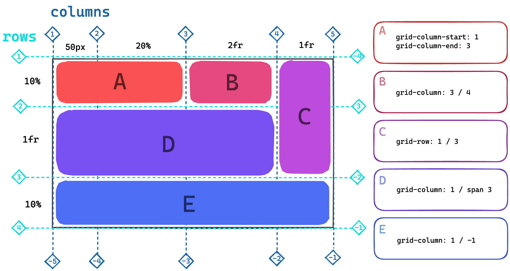

- [Linking Stylesheets](#Linking-Stylesheets)
- [Box Model](#Box-Model)
- [CSS Flexbox](#CSS-Flexbox)
- [CSS Grid](#CSS-Grid)
- [CSS Properties](#CSS-Properties)
- [CSS Responsive](#CSS-Responsive)
  - [Relative Units](#Relative-Units)
  - [Media Queries](#Media-Queries)
  - [Screen Size](#Screen-Size)
  - [Orientation](#Orientation)
  - [Pointer](#Pointer)
  - [Device Pixel Ratio](#Device-Pixel-Ratio)
  - [Color Scheme](#Color-Scheme)
  - [Reduced Motion](#Reduced-Motion)
  - [High Contrast](#High-Contrast)
  - [Other Media Features](#Other-Media-Features)
  - [Combining Media Features](#Combining-Media-Features)
  - [Simulating Media Features](#Simulating-Media-Features)
  - [Common Breakpoints](#Common-Breakpoints)
  - [Showing different images based on media queries](#image-change-based-on-media-queries)
- [CSS-Selectors](#CSS-Selectors)
  - [Id-Selectors](#Id-Selectors)
  - [Attribute-Selectors](#Attribute-Selectors)
  - [Pseudo-Classes](#Pseudo-Classes)
  - [Pseudo-Elements](#Pseudo-Elements)
  - [Combinators](#Combinators)
- [CSS Structure](#CSS-Structure)
  - [Import Stylesheets into another stylesheet](#Import-Stylesheets-to-stylesheet)
  - [BEM](#BEM)
- [CSS Syntax](#CSS-Syntax)
- [CSS Variables](#CSS-Variables)
- [Google Fonts](#Google-Fonts)
- [Include Custom Fonts](#Include-Custom-Fonts)
- [Positioning](#Positioning)
- [Z-Index](#Z-Index)

- [](#)
- [](#)
- [Links](#Links)

---

---

---

<a name="Box-Model"></a>

## Box Model


All elements of a website are wrapped in a **box model**. It's a way to define the size and position
of an element. There are four different parts: `content`, `padding`, `border` and `margin`.

| box model part | Function                                                 |
| -------------- | -------------------------------------------------------- |
| `content`      | The actual content of the element.                       |
| `padding`      | Space between the content and the border of the element. |
| `border`       | The border of the element.                               |
| `margin`       | The space around the border and other elements.          |

The property `box-sizing` changes the way how the `width` and `height` of an element is calculated.
The default value is `content-box`. The values of `width` and `height` set the size of the "content
box". With the value `border-box`, the size of the "border box" is set instead.

```css
* {
  box-sizing: border-box;
}
```

Now, the `width` property defines the size of the border box, padding and border width are
subtracted to calculate the available space for the content.

---

---

---

<a name="Linking-Stylesheets"></a>

## Linking Stylesheets

```html
<head>
  ...
  <link rel="stylesheet" href="styles.css" />
</head>
```

---

---

---

<a name="CSS-Syntax"></a>

## CSS Syntax

| Part           | Description                                                                                       |
| -------------- | ------------------------------------------------------------------------------------------------- |
| Selector       | Addresses the element(s) to style                                                                 |
| Declaration    | Defines what to change and contains pairs of `property` and `property value`                      |
| Property       | The name of the property to change                                                                |
| Property Value | The value assigned to the property, e.g for the property `color` we use the property value `blue` |

---

---

---

<a name="CSS-Properties"></a>

## CSS Properties

| Property           | Effect                                                                                                             |
| ------------------ | ------------------------------------------------------------------------------------------------------------------ |
| `color`            | Color of an element´s text                                                                                         |
| `font-size`        | Defines the size of a font                                                                                         |
| `text-align`       | Defines the alignment of text                                                                                      |
| `background-color` | Background color of an element                                                                                     |
| `border`           | Defines the border of an element.                                                                                  |
| `padding`          | Defines the padding of an element.                                                                                 |
| `margin`           | Defines the margin of an element.                                                                                  |
| `width`            | This property defines the width of an element.                                                                     |
| `box-sizing`       | The property changes the way how the width and height of an element is calculated.The default value is content-box |
| `display`          | grid/flex                                                                                                          |
| `font-family`      | grid/flex                                                                                                          |
| `font-size`        | grid/flex                                                                                                          |
| `font-weight`      | grid/flex                                                                                                          |

---

---

---

<a name="Include-Custom-Fonts"></a>

## Include Custom Fonts

You can include custom fonts in different ways:

- find a font on [google fonts](fonts.google.com) and use the `@import` snippet and paste it to the
  top of your css file:
  ```css
  @import url("https://fonts.googleapis.com/css2?family=Red+Hat+Mono:wght@300;			400;500;700&display=swap");
  ```
- use the provided HTML code to add the font via the `link` element in the `head` of your HTML file:

  ```html
  <link rel="preconnect" href="https://fonts.googleapis.com" />
  <link rel="preconnect" href="https://fonts.gstatic.com" crossorigin />
  <link
    href="https://fonts.googleapis.com/css2?family=Bangers&family=Montserrat&display=swap"
    rel="stylesheet"
  />
  ```

- download any font and include it as a `font-family`

  ```css
  @font-face {
    font-family: "Name of the font";
    src: url("path/to-the/font.woff");
  }
  ```

---

---

---

<a name="Google-Fonts"></a>

## Google Fonts

1. download font via [google webfonts helper](https://google-webfonts-helper.herokuapp.com/fonts) into folder "fonts"
2. copy code from google webfonts helper and insert it into css

---

---

---

<a name="CSS-Selectors"></a>

## CSS Selectors

<a name="Id-Selectors"></a>

## Id Selectors

```css
#title {
  color: blue;
}
```

<a name="Attribute-Selectors"></a>

## Attribute Selectors

Attribute selectors are written inside `[...]` square brackets.

- any element with the attribute hidden

  ```css
  [hidden] {
    ...;
  }
  ```

- all links which open a new tab:

  ```css
  [target="_blank"] {
    ...;
  }
  ```

- all elements with the class `card` and the attribute `role="list"`

  ```css
  .card[role="list"] {
    ...;
  }
  ```

[MDN web docs: Attribute-selectors](https://developer.mozilla.org/en-US/docs/Web/CSS/Attribute_selectors).

---

---

---

<a name="Pseudo-Classes"></a>

## Pseudo Classes

Style an HTML element differently when it is in a specific state. These are added to a selector and start with a **:** colon.

- hovered elements

  ```css
  h2:hover {
    ...;
  }
  ```

- active elements like a pressed button

  ```css
  button:active {
    ...;
  }
  ```

- links that have been visited

  ```css
  a:visited {
    ...;
  }
  ```

- form input that has received focus.

  ```css
  input:focus {
    ...;
  }
  ```

- elements which are the first child in another element

  ```css
  li:first-child {
    ...;
  }
  ```

- elements which are the nth child in another element. **n** is the argument that you can replace
  for example with a number or the words **even** and **odd**.

  ```css
  li:nth-child(n) {
    ...;
  }
  ```

[MDN web docs: Pseudo-classes](https://developer.mozilla.org/en-US/docs/Web/CSS/Pseudo-classes).

---

---

---

<a name="Pseudo-Elements"></a>

## Pseudo Elements

Pseudo elements let you style a specific part of the selected elements like the first line of a paragraph, the first-letter, the selection etc. They are written with **::** double colons directly after the original selector.

- this selects the first line of paragraphs

  ```css
  p::first-line {
    ...;
  }
  ```

- this creates pseudo elements as the first child of the selected elements

  ```css
  a::before {
    content: "🌍"; // property needed, can be empty
  }
  ```

- this creates pseudo elements as the last child of the selected elements

  ```css
  a::after {
    content: "📎"; // property needed, can be empty
  }
  ```

[MDN dev docs: Pseudo-elements](https://developer.mozilla.org/en-US/docs/Web/CSS/Pseudo-elements)

---

---

---

<a name="Combinators"></a>

## Combinators

Sometimes it is more efficient to combine multiple selectors instead of defining yet another CSS
class. You can chain together multiple selectors to form rather complex CSS selectors which apply
only in specific cases. In the example above we already combined three selectors: `a`, `:hover` and
`::after`. But there are also other ways to combine selectors:

- `(space)` : a specific element somewhere inside another specific element (regardless of nesting
  level)
  - `h2 span`: any span inside an h2
  - `.card button`: all buttons inside an element with the class "card"
- `>` : targeting a direct descendant of another element
  - `h2>span`: all spans which are direct children of an h2
  - `.card>button`: all buttons which are direct children of an element with the class "card"
- `~` : any later sibling element after another element
  - `h2~span`: any span which is a later sibling of an h2
- `+` : the direct sibling element after another element
  - `.card+button`: a button coming directly after an element with the class "card"

Many combinators can be chained. Can you figure out which element would be styled by the following
selector?

```css
body section > ul[role="list"] > li::before {
  ...;
}
```

---

<a name="CSS-Structure"></a>

## CSS Structure

## Learning Objectives

- Understanding how the browser decides which CSS property to use when there are conflicting rules,
  regarding CSS cascade and CSS specificity
- Structuring CSS to improve maintainability and readability
- Organizing and naming CSS classes with BEM method
- Creating and reusing Custom CSS properties, also called CSS variables

---

## CSS Cascade

The cascade is the algorithm that defines which CSS rules are being applied when there are
conflicting rules.

When styling an element the browser:

1. Searches for all rules with matching selectors
2. Sorts the rules by their importance taking into account:
   - Whether the declaration is followed by **!important**
   - The rule's origin (Browser stylesheet, User stylesheet, Author stylesheet)
3. Sorts rules by their [specificity](#specificity), if there are multiple rules with the same
   importance according to no. 2.
4. Chooses the last declaration over previous ones, if there are multiple rules with the same
   importance and the same specificity.

You can read about the details in the
[CSS Cascade mdn docs](https://developer.mozilla.org/en-US/docs/Web/CSS/Cascade).

> ❗️ We recommend never using !important unless you absolutely have to. It is almost impossible to
> overwrite a CSS rule with !important.

---

## Specificity

The specificity of a CSS selector tells the browser which rule is most relevant for an element. The
more specific rules win over less specific ones.

You can find a list of the specificity of different selectors on
[specifishity.com](https://specifishity.com/).

The **universal selector** is the lease specific one. It is overwritten by any other CSS rule with
any other matching CSS selector.

**type selectors** like `div` have a low specificity and can easily be overwritten.

**class selectors** like `.bright` and **attribute selectors** like `[type=checkbox]` have a higher
specificity.

---

## CSS Structure best practices

- keep your CSS consistent throughout a project. In collaborative projects, there are often coding
  style guidelines.
- separate global and local styles into different files (or sections of files)
- create multiple stylesheets for different parts of your application
  - structure your code by thinking in reusable **components**. You can write your CSS for every
    component in its own CSS file.

<a name="Import-Stylesheets-to-stylesheet"></a>

### How to import one stylesheet or multiple stylesheets into another stylesheet

You can import one stylesheet into another stylesheet using **@import**:

```css
@import "customer-card.css";
```

---

<a name="BEM"></a>

## BEM

BEM is short for "Block, Element, Modifier". It is a method that allows you to craft reusable
components through CSS class naming conventions.

```css
.block {
  ...;
}
.block__element {
  ...;
}
.block--modifier {
  ...;
}
```

A **block** is a standalone entity or component.

An **element** is a part of your block (or component) that has no standalone meaning.

A **modifier** is a flag on your block (or component) that is used to change its appearance or
behavior. E.g. disabled, checked, bright, etc. .

You can find an [introduction to BEM here](http://getbem.com/introduction/).

### Kebab Case naming convention

The kebab case naming convention defines to use hyphens to separate words in variables. Many
developers use the kebab case convention to write css classes. In BEM we also use kebab case, for
example:

```css
.customer-card {
  ...;
}
.customer-card__button {
  ...;
}
.customer-card--disabled {
  ...;
}
```

---

---

---

<a name="CSS-Responsive"></a>

# CSS Responsive

## Learning Objectives

- [ ] Understanding the concept of responsive design
- [ ] Understanding why we work mobile first (in design and CSS)
- [ ] Understanding responsive units
- [ ] Understanding media queries

---

## Mobile First Design

When authoring CSS, it's a very helpful convention to first define all your mobile styles, and then
add media queries to adjust the styles for larger screens. It's easier to reason about, and it
results in a simpler CSS structure. Your code will be more similar to the way other people write
CSS.

When designing, it makes sense to begin designing mobile first, because most users are on mobile
devices. This also helps you to focus on the most important information (you have less space), and
to structure it in a way that makes sense for mobile users.

---

<a name="Relative-Units"></a>

## Relative Units

Relative units are units that are relative to the size of the viewport, the current font size, or
the size of their parent element.

- `vh` (viewport height): 1vh is 1% of the viewport height
- `vw` (viewport width): 1vw is 1% of the viewport width
- `em`: 1em is the current font size
- `rem`: 1rem is the font size of the root element
- `%`: 1% is 1% of the size of the parent element (this is calculated for width and height
  separately)
- `calc()`: allows you to combine multiple units and do math
  - e.g. `calc(100vh - 100px)`
  - or `calc(50% - 10rem)`

---

<a name="Media-Queries"></a>

## Media Queries

Media queries allow you to write CSS for specific media types, screen sizes, orientations and more.

They follow the following syntax:

```css
@media (media feature) {
  /* CSS rules */
}
```

<a name="Screen-Size"></a>

### Media Types

You can target a specific media type with the `screen` and `print` media types.

```css
@media screen {
  /* CSS rules that are only applied on screens */
}
@media print {
  /* CSS rules that are only applied when printing */
}
```

<a name="Screen-Size"></a>

### Screen Size

You can target specific screen sizes with the `min-width` and `max-width` media features.

```css
@media (min-width: 600px) {
  /* CSS rules that are only applied when the screen is at least 600px wide */
}
@media (max-width: 600px) {
  /* CSS rules that are only applied when the screen is at most 600px wide */
}
```

> 💡 Avoid `max-width` media queries, because they are harder to reason about. It's easier to think
> about the smallest screen size first, and then add media queries for larger screens.

<a name="Orientation"></a>

### Orientation

You can target specific orientations with the `orientation` media feature.

```css
@media (orientation: portrait) {
  /* CSS rules that are only applied when the screen is in portrait orientation */
}
@media (orientation: landscape) {
  /* CSS rules that are only applied when the screen is in landscape orientation */
}
```

> 💡 You can also target a specific aspect ratio with the
> [`aspect-ratio` media feature](https://developer.mozilla.org/en-US/docs/Web/CSS/@media/aspect-ratio).

<a name="Pointer"></a>

### Pointer

You can target specific pointer types with the `any-pointer` media feature.

```css
@media (any-pointer: none) {
  /*
		CSS rules that are only applied when the device has no pointer
		(neither touch nor cursor)
	*/
}
@media (any-pointer: coarse) {
  /*
		CSS rules that are only applied when the device has a coarse pointer
		(mostly touch)
	*/
}
@media (any-pointer: fine) {
  /*
		CSS rules that are only applied when the device has a fine pointer
		(cursor)
	*/
}
```

<a name="Device-Pixel-Ratio"></a>

### Device Pixel Ratio (Pixel Density)

You can target specific device pixel ratios with the `device-pixel-ratio` media feature.

```css
@media (device-pixel-ratio: 1) {
  /*
		CSS rules that are only applied when the device has a pixel ratio of 1
		(mostly older screens)
	*/
}
@media (device-pixel-ratio: 2) {
  /*
		CSS rules that are only applied when the device has a pixel ratio of 2
		(newer screens like the retina screen on your MacBook)
	*/
}
@media (device-pixel-ratio: 3) {
  /*
		CSS rules that are only applied when the device has a pixel ratio of 3
		(some high resolution tablets and phones)
	*/
}
```

<a name="Color-Scheme"></a>

### Color Scheme

You can target specific color schemes with the `prefers-color-scheme` media feature.

```css
@media (prefers-color-scheme: dark) {
  /* CSS rules that are only applied when the user prefers a dark color scheme */
}
@media (prefers-color-scheme: light) {
  /* CSS rules that are only applied when the user prefers a light color scheme */
}
```

> 💡 You can change your preferred color scheme in your operating system settings. On macOS, you can
> do this in System Preferences > General > Appearance.

<a name="Reduced-Motion"></a>

### Reduced Motion

You can target users who are sensitive to animations and movement (and set up their system
accordingly) with the `prefers-reduced-motion` media feature.

```css
@media (prefers-reduced-motion: reduce) {
  /* CSS rules that are only applied when the user prefers reduced motion */
}
```

> 💡 You can change your preferred reduced motion setting in your operating system settings. On
> macOS, you can do this in System Preferences > Accessibility > Display > Reduce motion.

<a name="High-Contrast"></a>

### High Contrast

You can target users who prefer a higher contrast with the `prefers-contrast` media feature.

```css
@media (prefers-contrast: high) {
  /* CSS rules that are only applied when the user prefers a higher contrast */
}
```

> 💡 You can change your preferred contrast setting in your operating system settings. On macOS, you
> can do this in System Preferences > Accessibility > Display > Increase contrast.

<a name="Other-Media-Features"></a>

### Other Media Features

There are also media features for other (accessibility) features, like
[`inverted-colors`](https://developer.mozilla.org/en-US/docs/Web/CSS/@media/inverted-colors). The
list of all media features is always growing. Check out
[the full list](https://developer.mozilla.org/en-US/docs/Web/CSS/@media#media_features) on mdn.

<a name="Combining-Media-Features"></a>

### Combining Media Features

You can combine multiple media features with `and`.

```css
@media (min-width: 600px) and (orientation: landscape) {
  /* CSS rules that are only applied when the screen is at least 600px wide and in landscape orientation */
}
```

<a name="Simulating-Media-Features"></a>

### Simulating Media Features

You can simulate media features in the browser devtools. For example, you can change your screen
size in the devtools by clicking the device icon in the top left corner of the devtools.

<a name="Common-Breakpoints"></a>

### Common Breakpoints

When using `min-width` media queries it can be helpful to use common breakpoints.

- no media query (default): extra-small, xs, mobile
- `(min-width: 640px)`: small, sm, large mobile
- `(min-width: 768px)`: medium, md, tablet
- `(min-width: 1024px)`: large, lg, desktop
- `(min-width: 1280px)`: extra-large, xl, large desktop
- `(min-width: 1536px)`: extra-extra-large, 2xl, very large desktop

> 💡 These breakpoints are based on the
> [Tailwind CSS breakpoints](https://tailwindcss.com/docs/breakpoints). Other frameworks and
> projects might define a completely different set of breakpoints. Mostly they are defined to be
> between the most common screen sizes.
> 🪄 **Pro Tip**: You can use media queries to redefine the values of CSS custom properties. This way
> you can use the property as a value that dynamically changes based on the media query.

```css
:root {
  --font-size: 12px;
}
@media (min-width: 640px) {
  :root {
    --font-size: 16px;
  }
}
@media (min-width: 1024px) {
  :root {
    --font-size: 20px;
  }
}
body {
  font-size: var(--font-size);
}
```

---

<a name="image-change-based-on-media-queries"></a>

## Showing different images based on media queries

You can use media queries to show different images based on the screen size.

The html `picture` element allows you to define multiple `source` elements for an image. The browser
will choose the _first_ source that matches the given media query. If no `source` element matches,
the browser will use the `img` element as a fallback.

The `img` element is required, so that there is always a fallback.

```html
<picture>
  <source
    media="(min-width: 1280px)"
    srcset="https://source.unsplash.com/random/1400x1050"
  />
  <source
    media="(min-width: 768px)"
    srcset="https://source.unsplash.com/random/800x600"
  />
  
</picture>
```

> 💡 Note that the `source` element doesn't have a `src` attribute but uses the `srcset` attribute
> instead. This can be used to help with performance but is not relevant for this session.

---

## Resources

- [Responsive Design on mdn](https://developer.mozilla.org/en-US/docs/Learn/CSS/CSS_layout/Responsive_Design)
- [Responsive Web Design Basics on web.dev](https://web.dev/responsive-web-design-basics/)
- [Values and Units on mdn](https://developer.mozilla.org/en-US/docs/Learn/CSS/Building_blocks/Values_and_units)
- [Beginner's Guide to Media Queries on mdn](https://developer.mozilla.org/en-US/docs/Learn/CSS/CSS_layout/Media_queries)
- [@media on mdn](https://developer.mozilla.org/en-US/docs/Web/CSS/@media)
- [The Picture element on mdn](https://developer.mozilla.org/en-US/docs/Web/HTML/Element/picture)
- [Is your web page mobile-friendly? on Google](https://search.google.com/test/mobile-friendly)

---

---

---

<a name="CSS-Variables"></a>

## Custom properties (CSS variables)

You can store values in custom properties, so you can use them again multiple times without having
to write the value.

A common practice is to define variables in the `:root` pseudo class selector as follows:

```css
:root {
  --primary-color: #ff00ff;
  --secondary-color: #f00f0f;
}
```

> ❗️ Custom properties have to be prefixed with `--`
> You can use the custom properties as follows:

```css
.customer-card {
  color: var(--primary-color);
  background-color: var(--secondary-color);
}
```

---

## Resources

- [MDN docs: CSS Cascade](https://developer.mozilla.org/en-US/docs/Web/CSS/Cascade)
- [specifishity.com](https://specifishity.com/)
- [Introduction to BEM](http://getbem.com/introduction/)

---

---

---

<a name="Positioning"></a>

## Positioning

There are 5
different values to define the position:

| Type                 | Description                                                                                                         |
| -------------------- | ------------------------------------------------------------------------------------------------------------------- |
| `position: static`   | The position of the element is determined by the document flow (default)                                            |
| `position: relative` | Position the element relative to where the element would be placed normally                                         |
| `position: absolute` | Position the element absolutely inside the **nearest non-static ancestor element**                                  |
| `position: fixed`    | Position the element on a fixed position on the screen.                                                             |
| `position: sticky`   | The element is placed normally in the document flow, but keeps an offset relative to its nearest scrolling ancestor |

The position is then specified by the four position properties `top`, `bottom`, `right`, `left`.
These work differently depending on the positioning method.

### position: static

Elements are positioned according to the normal document flow. The properties `top`, `bottom`,
`right`, `left` have no effect. This is the default value.

---

### position: relative

Elements are positioned according to the normal document flow and then displaced by the `top`,
`bottom`, `right`, `left` properties. This method is also used to set the reference frame for an
absolutely positioned child element. By doing so, the child element will be placed absolutely inside
this element.


### position: absolute

Elements are removed from the normal document flow and no space is created for them - so they leave
no gap in the page. With position absolute you place an element (with the `top`, `bottom`, `right`,
`left` properties) relative to a reference frame. The reference frame is the view-box of the closest
ancestor element that does not have `position: static` (default).

In the picture below you can see two examples.

In the first, no non-static ancestor element exists, therefore the reference frame falls back to the
page.

In the second example, the element is inside another element with `position: relative`. Therefore,
the element is placed absolutely towards this element and not the entire page.


---

### Position Fixed

Elements are removed from the normal document flow and no space is created for them - so they leave
no gap in the page. An element with position fixed is not influenced by scrolling and therefore
stays at the specified position. This is often used for navigation bars or "back to top" buttons.


---

### Position Sticky

This is an unusual but very nifty positioning method. The element is not affected by the positioning
until it comes near the border of its scrolling container (normally the page itself). When the user
continues scrolling, a specified offset is enforced. The element sticks to this offset and appears
like a fixed element.


---

---

---

<a name="Z-Index"></a>

## Z - Index

The z-index defines the stacking order of html elements. Elements with a higher stacking order
appear on top if they overlap with other elements. The z-index can be an integer number (negative
numbers are possible) or it can have the default value `auto` which sets the stack order equal to
its parents. The z-index only effects positioned elements - that is elements with a non-static
position value.

---

---

---

<a name="CSS-Flexbox"></a>

# CSS Flexbox

- letting items fill out the possible space in their container
- distributing elements for different screen sizes
- making the website more responsive with flexbox

1. Define a flex container:

```css
.container-element {
  display: flex;
}
```

- All child elements will be displayed next to each other along the main axis, the horizontal axis
  by default. The perpendicular axis is called cross axis.
- If the width of all child elements exceeds the container's width, the child elements will be
  shrunk such that they all fit into the available space.

---

## Important Flex Properties

| property                                                                            | effect                                                                                                                                                       |
| ----------------------------------------------------------------------------------- | ------------------------------------------------------------------------------------------------------------------------------------------------------------ |
| [justify-content](https://developer.mozilla.org/en-US/docs/Web/CSS/justify-content) | Defines the positioning of elements along the main axis. Useful values: `flex-start`, `flex-end`, `center` , `space-between`, `space-evenly`, `space-around` |
| [align-items](https://developer.mozilla.org/en-US/docs/Web/CSS/align-items)         | Defines the positioning of elements along the cross axis. Useful values: `flex-start`, `flex-end`, `center`                                                  |
| [gap](https://developer.mozilla.org/en-US/docs/Web/CSS/gap)                         | Defines the minimum spacing between elements.                                                                                                                |
| [flex-direction](https://developer.mozilla.org/en-US/docs/Web/CSS/flex-direction)   | Sets the direction of the main axis. Useful values: `row`, `column`                                                                                          |
| [flex-wrap](https://developer.mozilla.org/en-US/docs/Web/CSS/flex-wrap)             | Modifies how elements can wrap into another row instead of being squashed into one row. Useful values: `wrap`, `no-wrap`                                     |
| `gap` `column-gap` `row-gap`                                                        |                                                                                                                                                              |
| [align-self](https://developer.mozilla.org/en-US/docs/Web/CSS/align-self)           | `auto` `flex-start` `flex-end` `center` `baseline` `stretch`                                                                                                 |

- [Flexbox Cheat Sheet](https://css-tricks.com/snippets/css/a-guide-to-flexbox/)

---

## Flex-wrap

This property is very useful for creating responsive layouts. With the property set to
`flex-wrap: wrap` the elements flow into the next row when they wouldn't fit into the current row.
Depending on the screen width, the content can align itself, as shown in the following example.


---

## Flex-direction

This very fundamental property lets you define which axis should act as main axis. In this picture
you can see its effect.


It changes the layout completely. The property `align-items`, which
defines the positioning on the cross axis, also changes with the definition of the flex-direction.

---

---

---

<a name="CSS-Grid"></a>

# CSS Grid

- positioning elements in Grid cells
- aligning cells in a Grid

1. Defining the layout on a container element
2. Positioning the children on the grid cells

### 1. Defining the layout on a container element

The display mode is defined on a container element that contains all the elements to be positioned as direct children in the grid.
Columns and rows can be defined through

```
.container {
  display: grid;
  grid-template-columns: 50px 20% 2fr 10em;
  grid-template-rows: 3fr 1fr 1fr;
}
```

### 2. Positioning the children on the grid cells

Positioning properties are set on the child elements, not on the container!

After the grid is set up on the container element, its children are placed inside the grid cells from left to right, top to bottom. By default, the elements are stretched such that they take up all the available cell space.

```
.container__item {
  grid-column: 2 / 4; /* beginning / end */
  grid-row: 1 / 6; /* beginning / end */
}
```



### grid-area

```
.container {
  display: grid;
  grid-template-areas:
	  'a a b c'
	  'd d d c'
	  'e e e e'; /* define names for grid-areas */
}
```

```
.element-a {
	grid-area: a;
}
.element-b {
	grid-area: b;
}
...
```

## Column and Row Alignment

The combined size of the grid columns/rows you defined might be less than a given height/width of
the grid container. In this case you can distribute the columns or rows inside the grid container.
| Property | Effect |
| ----------------------------------------------------------------------------------- | ----------------------------------------------- |
| [justify-content](https://developer.mozilla.org/en-US/docs/Web/CSS/justify-content) | Sets the alignment of the `columns`. |
| [align-content](https://developer.mozilla.org/en-US/docs/Web/CSS/align-content) | Sets the alignment of the `rows`. |
| [place-content](https://developer.mozilla.org/en-US/docs/Web/CSS/place-content) | Sets the alignment of the `rows` and `columns`. |

## Cell Alignment

The position of the elements _inside_ their cells can be specified on the grid container.
| Property | Effect |
| ------------------------------------------------------------------------------- | ----------------------------------------------- |
| [justify-items](https://developer.mozilla.org/en-US/docs/Web/CSS/justify-items) | Sets the `horizontal` alignment. |
| [align-items](https://developer.mozilla.org/en-US/docs/Web/CSS/align-items) | Sets the `vertical` alignment. |
| [place-items](https://developer.mozilla.org/en-US/docs/Web/CSS/place-items) | Sets the `vertical` and `horizontal` alignment. |

---

---

---

<a name="Links"></a>

## Links

- [MDN web docs: CSS properties](https://developer.mozilla.org/en-US/docs/Web/CSS/Reference#index)
- [google webfonts helper](https://google-webfonts-helper.herokuapp.com/fonts)

- [Common CSS Properties](https://developer.mozilla.org/en-US/docs/Web/CSS/CSS_Properties_Reference)
- [MDN web docs: CSS - First Steps](https://developer.mozilla.org/en-US/docs/Learn/CSS/First_steps)
- [Styling text](https://developer.mozilla.org/en-US/docs/Learn/CSS/Styling_text)
- [CSS Tricks: Box-sizing](https://css-tricks.com/box-sizing/)
- [Josh Comeau: Surprising truth about pixels and accessibility](https://www.joshwcomeau.com/css/surprising-truth-about-pixels-and-accessibility/)
- [rem/px calculator](https://nekocalc.com/de/px-zu-rem-umrechner)

### CSS Selectors

- [MDN web docs: Attribute-selectors](https://developer.mozilla.org/en-US/docs/Web/CSS/Attribute_selectors)
- [MDN web docs: Pseudo-classes](https://developer.mozilla.org/en-US/docs/Web/CSS/Pseudo-classes)
- [MDN web docs: Pseudo-elements](https://developer.mozilla.org/en-US/docs/Web/CSS/Pseudo-elements)

### Positioning

- [MDN web docs: position](https://developer.mozilla.org/en-US/docs/Web/CSS/position)
- [MDN web docs: Using positioning](https://developer.mozilla.org/en-US/docs/Learn/CSS/CSS_layout/Positioning)
- [MDN web docs: z-index](https://developer.mozilla.org/en-US/docs/Web/CSS/z-index)
- [MDN web docs: Using z-index](https://developer.mozilla.org/en-US/docs/Web/CSS/CSS_Positioning/Understanding_z_index/Adding_z-index)
- [MDN web docs: Stacking context](https://developer.mozilla.org/en-US/docs/Web/CSS/CSS_Positioning/Understanding_z_index/The_stacking_context)
- [`z-index` and stacking context by Josh W. Comeau](https://www.joshwcomeau.com/css/stacking-contexts/)

### Flexbox

- [Flexbox Cheat Sheet](https://css-tricks.com/snippets/css/a-guide-to-flexbox/)
- [MDN web docs: Flexbox](https://developer.mozilla.org/en-US/docs/Learn/CSS/CSS_layout/Flexbox)
- [CSS Battle](https://cssbattle.dev/)

### Grid Layout

- [MDN web docs: CSS Grid Layout](https://developer.mozilla.org/en-US/docs/Web/CSS/CSS_Grid_Layout)
