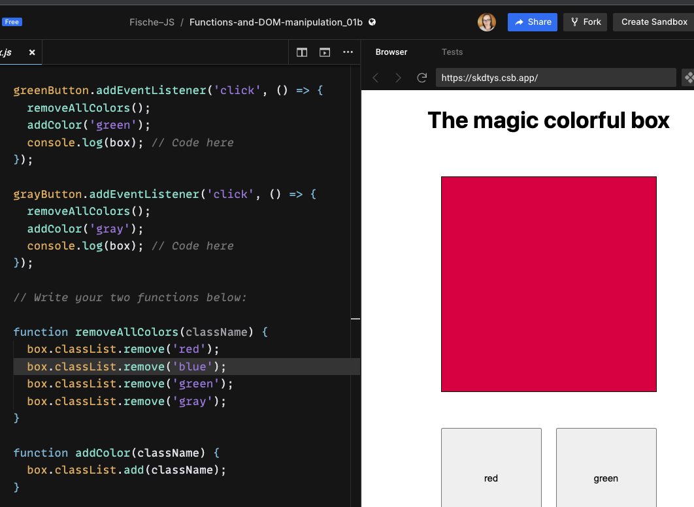
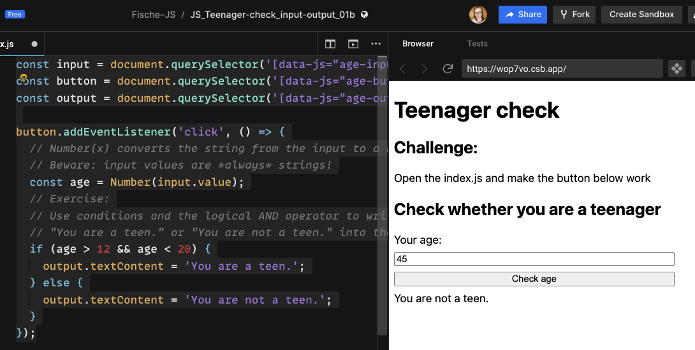
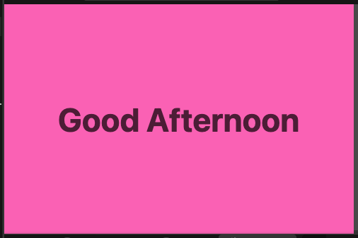
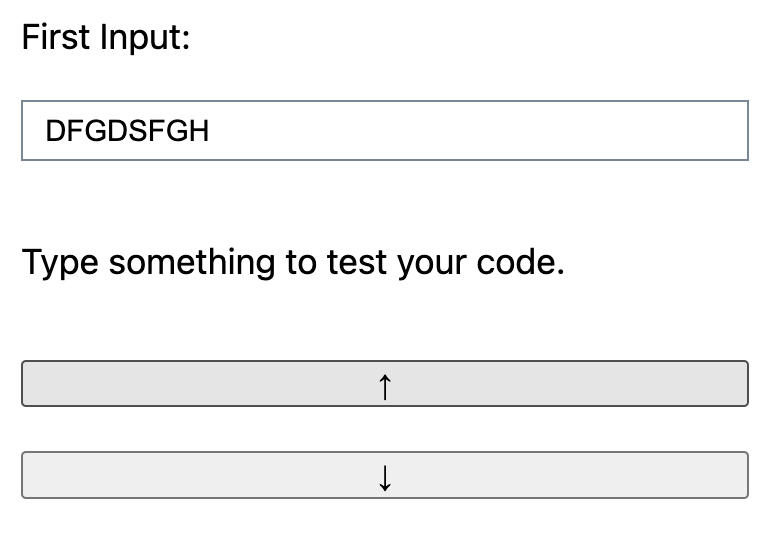
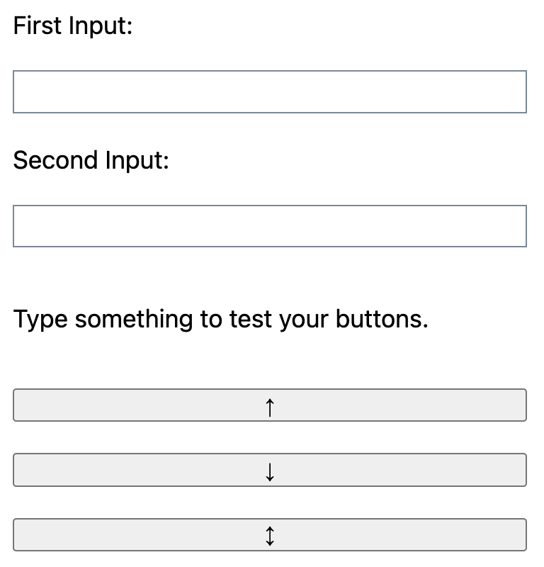
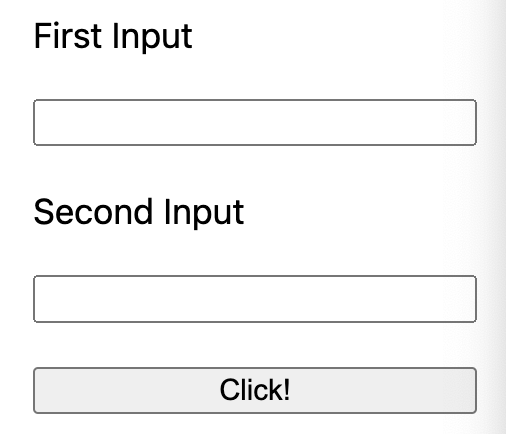
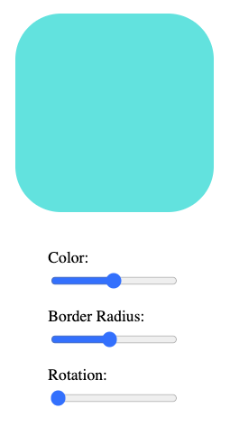

## Connect a JavaScript file

```html
<head>
  ...
  <script src="./index.js" defer></script>
</head>
<body>
  ...
</body>
```

## Selecting HTML Elements: `.querySelector()`

```js
const mainElement = document.querySelector('[data-js="main"]');
```

```js
// tag as identifier
const mainElement = document.querySelector("main");
// class as identifier -> .
const mainElement = document.querySelector(".main");
// id as identifier -> #
const mainElement = document.querySelector("#main");
```

## Add Interaction: `.addEventListener()`

```js
const button = document.querySelector('[data-js="button"]');
button.addEventListener("click", () => {
  console.log("Yeah");
});
```

```js
button.addEventListener("mouseover", () => {});
```

```js
button.addEventListener("keydown", () => {});
```

## Add/remove & toggle classes: `.classList.`

```js
const main = document.querySelector('[data-js="main"]');
const button = document.querySelector('[data-js="button"]');
button.addEventListener("click", () => {
  main.classList.add("page--primary");
});
```

```js
main.classList.remove("page--primary");
```

```js
main.classList.toggle("page--primary");
```



```JS
greenButton.addEventListener('click', () => {
  removeAllColors();
  addColor('green');
  console.log(box); // Code here
});

grayButton.addEventListener('click', () => {
  removeAllColors();
  addColor('gray');
  console.log(box); // Code here
});

// Write your two functions below:

function removeAllColors(className) {
  box.classList.remove('red');
  box.classList.remove('blue');
  box.classList.remove('green');
  box.classList.remove('gray');
}

function addColor(className) {
  box.classList.add(className);
}
```

## Variable Declarations

```js
const aNewVariable = 1234;
```

```js
let counter = 0;
counter = counter + 1; // reassigning the value of counter
```

## Primitive Data Types

| type        | represents                                                                                                                  |
| ----------- | --------------------------------------------------------------------------------------------------------------------------- |
| `string`    | a sequence of characters: "abcd"                                                                                            |
| `number`    | a number: 1234                                                                                                              |
| `boolean`   | a binary statement, can be `true` or `false`                                                                                |
| `null`      | represents "nothing", is typically set by developers                                                                        |
| `undefined` | represents the state of "not existing". Anything not specified or not found in JavaScript defaults to the value `undefined` |
| `BigInt`    | uncommon, used for integers larger than 9007199254740991                                                                    |
| `Symbol`    | uncommon, used for creating unique elements                                                                                 |

## Math & Operators

| operator | precedence | effect                                                                                       |
| -------- | ---------- | -------------------------------------------------------------------------------------------- |
| `+`      | 11         | adds two numbers together.                                                                   |
| `-`      | 11         | subtracts two numbers                                                                        |
| `*`      | 12         | multiplies two numbers                                                                       |
| `/`      | 12         | divides two numbers                                                                          |
| `**`     | 13         | potentiates two numbers: `2 ** 4 → 16`                                                       |
| `%`      | 12         | The remainder or modulus. Gives you what remains after a whole number division: `8 % 3 → 2`. |

## Assignment Operators

| operator | effect                                                                                                                |
| -------- | --------------------------------------------------------------------------------------------------------------------- |
| `+=`     | Increases the value of the variable on the left about the value on the right: `count += 6` → count is increased by 6. |
| `-=`     | Decreases the value of the variable on the left about the value on the right.                                         |
| `*=`     | Multiplies the variable on the left with the value on the right.                                                      |
| `/=`     | Divides the variable on the left with the value on the right.                                                         |
| `++`     | Increments the value of a variable by one: `count++` → count is increased by one                                      |
| `--`     | Decrements the value of a variable by one: `count--` → count is decreased by one                                      |

## Truthy and Falsy Values

- _truthy_ values:

  - non zero numbers: `1`, `2`, `-3`, etc.
  - non empty strings: `"hello"`
  - `true`

- _falsy_ values:
  - `0` / `-0`
  - `null`
  - `false`
  - `undefined`
  - empty string: `""`

## Comparison Operators

| Operator  | Effect                                                                           |
| --------- | -------------------------------------------------------------------------------- |
| A `===` B | strict equal: is `true` if both values are equal (including their type).         |
| A `!==` B | strict not equal: is `true` if both values are not equal (including their type). |
| A `>` B   | strictly greater than: is `true` if A is greater than B.                         |
| A `<` B   | strictly less than: is `true` if A is less than B.                               |
| A `>=` B  | greater than or equal: is `true` if A is greater than or equal B.                |
| A `<=` B  | less than or equal: is `true` if A is less than or equal B.                      |

## Logical Operators

| Operator                      | Effect                                                 |
| ----------------------------- | ------------------------------------------------------ |
| `!`A                          | `not`: flips a `true` value to `false` and vice versa. |
| A <code>&#124;&#124;</code> B | `or`: is `true` if either A `or` B is true.            |
| A `&&` B                      | `and`: is `true` if both A `and` B is true.            |

> 💡 You can combine logical operators with brackets to define which operator should be evaluated
> first, e.g:
>
> - `(A || B) && (C || D)`
> - `!(A || B)`

## Control Flow: `if / else`

```js
const isSunShining = true;
if (isSunShining) {
  // code that is executed only if condition "isSunShining" is true
}
```

```js
if (hour < 12) {
  console.log("Good Morning.");
} else if (hour < 18) {
  console.log("Good afternoon.");
} else if (hour === 24) {
  console.log("Good night.");
} else {
  console.log("Good evening.");
}
```

```js
const name = "Alex";
if (name) {
  console.log("Hi " + name + "!"); // only executed if name is not an empty string
}
```



```js
const input = document.querySelector('[data-js="age-input"]');
const button = document.querySelector('[data-js="age-button"]');
const output = document.querySelector('[data-js="age-output"]');

button.addEventListener("click", () => {
  // Number(x) converts the string from the input to a number
  // Beware: input values are *always* strings!
  const age = Number(input.value);
  // Exercise:
  // Use conditions and the logical AND operator to write
  // "You are a teen." or "You are not a teen." into the output.
  if (age > 12 && age < 20) {
    output.textContent = "You are a teen.";
  } else {
    output.textContent = "You are not a teen.";
  }
});
```



```JS
const display = document.querySelector('[data-js="display"]');

function getGreeting() {
  if (new Date().getHours() >= 6 && new Date().getHours() <= 12) {
    return 'Good Morning';
  } else if (new Date().getHours() > 12 && new Date().getHours() < 19) {
    return 'Good Afternoon';
  } else if (new Date().getHours() > 18 && new Date().getHours() < 23) {
    return 'Good Evening';
  } else if (new Date().getHours() > 22 && new Date().getHours() < 6) {
    return 'Good Night';
  }
  // Code here
}

function getDayColor() {
  if (new Date().getDay() === 1) {
    return 'darkgray';
  }
  if (
    new Date().getDay() === 2 ||
    new Date().getDay() === 3 ||
    new Date().getDay() === 4 ||
    new Date().getDay() === 5
  ) {
    return 'lightblue';
  }
  if (new Date().getDay() === 6 || new Date().getDay() === 0) {
    return 'hotpink';
  }
  // Code here
}

display.textContent = getGreeting();
document.body.style.backgroundColor = getDayColor();
```

## Ternary Operator: `? :`

```js
const greetingText = time < 12 ? "Good morning." : "Good afternoon.";
```

The ternary operator has the following structure:

```js
condition ? expressionIfTrue : expressionIfFalse;
```

```js
isUserLoggedIn ? logoutUser() : loginUser();
```

```js
moveElement(xPos > 300 ? 300 : xPos); // the element can't be moved further than 300.
```

## Function Declarations

- the function keyword
- the function name
- the function body (Javascript statements / Javascript code)

```js
function greet() {
	console.log('Hi Friends!');
	console.log('Nice to be here.');
}
#### Function Call
greet();
/*
This will cause the following to be logged into the console:
Hi Friends!
Nice to be here.
*/
```

> ❗️ Defining a function does not cause the Javascript code in the function body to be executed.
> You have to call the function for the code to be executed.

### Parameters

Functions can accept parameters. Parameters can be used like predefined variables inside the
function body. When declaring a function we are free to choose a name for the parameters , but
descriptive, short names should be chosen.

```js
function printLetter(name) {
	console.log('Hi ' + name + ', hope you are fine. Love, Johnny');
}
#### Function Call
printLetter('Max');
printLetter('Jordan');
/*
This will cause the following to be logged into the console:
Hi Max, hope you are fine. Love, Johnny
Hi Jordan, hope you are fine. Love, Johnny
*/
function printSum(first, second, third) {
	const sum = first + second + third;
	console.log('The sum of your numbers is: ' + sum);
}
#### Function Call
printSum(1, 2, 3);
printSum(3, 4, 5);
/*
This will cause the following to be logged into the console:
The sum of your numbers is: 6
The sum of your numbers is: 12
*/
```

## Function Calls

```js
function greetMary() {
  console.log("Welcome Mary, good to see you again!");
}
greetMary();

// function with a parameter:

function greet(name) {
  console.log("Welcome " + name + " , good to see you again!");
}

greet("Mary");
```

```js
function printSquare(number) {
  const square = number * number;
  console.log(square);
}

printSquare(3);
printSquare(5);
```

## Return Statements

```js
function add3Numbers(first, second, third) {
  const sum = first + second + third;
  return sum;
}
```

The `return statement` begins with the keyword `return` followed by an expression. Its value is returned by the function and can be stored when the function is called:

```js
const firstSum = add3Numbers(1, 2, 3);
// the return value is stored in "firstSum", namely 6
const secondSum = add3Numbers(4, 123, 33);
// the return value is now stored in "secondSum", namely 160
```

```js
function setBackgroundColor(color) {
  if (typeof color === "String") {
    if (color.startsWith("#")) {
      if (color.length >= 7) {
        body.style.backgroundColor = color;
      }
    }
  }
}
```


```JS
const progressBar = document.querySelector('[data-js="progress-bar"]');

function calculateScrollPercentage() {
  const percentage =
    (window.scrollY / (document.body.clientHeight - window.innerHeight)) * 100;
  return percentage;
}

window.addEventListener('scroll', () => {
  progressBar.style.width = calculateScrollPercentage() + '%';
  console.log(calculateScrollPercentage());
});
```

An alternative approach is to terminate the function with early return statements:

```js
function setBackgroundColor(color) {
	// first condition
	if(typeOf color !== 'String') {
		return;
	}
	// second condition
	if(!color.startsWith('#')) {
		return;
	}
	// third condition
	if(color.length < 7) {
		return;
	}
	// only if all 3 conditions are passed the final line of code is executed.
	body.style.backgroundColor = color;
}
```

## Arrow Function Expressions

```js
const addNumbers = (first, second) => {
  return first + second;
};
```

```JS
/*
Rewrite the following functions as arrow functions.
Use implicit returns when possible
*/

function getCurrentHour() {
  const now = new Date();
  const currentHour = now.getHours();
  if (currentHour === 0) {
    return '12am';
  } else if (currentHour === 12) {
    return '12pm';
  } else if (currentHour <= 11) {
    return currentHour + 'am';
  } else {
    return currentHour - 12 + 'pm';
  }
}

const getCurrentHour = () => {
  const now = new Date();
  const currentHour = now.getHours();
  if (currentHour === 0) {
    return '12am';
  } else if (currentHour === 12) {
    return '12pm';
  } else if (currentHour <= 11) {
    return currentHour + 'am';
  } else {
    return currentHour - 12 + 'pm';
  }
};

function getVectorLength(x, y, z) {
  return (x ** 2 + y ** 2 + z ** 2) ** 0.5;
}

const getVectorLength = (x, y, z) => (x ** 2 + y ** 2 + z ** 2) ** 0.5;

function cleanInput(string) {
  return string.toLowerCase().trim();
}

const cleanInput = string => string.toLowerCase().trim();

/*
Rewrite the following arrow functions as classic functions.
*/

const isOddAndSmall = number => {
  if (number > 10) {
    return false;
  }

  if (number % 2 === 0) {
    return false;
  }

  return true;
};

function isOddAndSmall(number) {
  if (number > 10) {
    return false;
  }

  if (number % 2 === 0) {
    return false;
  }

  return true;
}

const add3 = (a, b, c) => a + b + c;

function add3(a, b, c) {
  return a + b + c;
}

const repeat10 = string => string.repeat(10);

function repeat10(string) {
  return string.repeat(10);
}
```

### Implicit Return Statements

1. Omit the round brackets around the parameters: This is possible, if there is only one input:
   ```js
   const addOne = (number) => {
     return number + 1;
   };
   ```
2. Implicit return statements: If the function consists only of a return statement, the curly
   brackets and the return keyword can be omitted:
   ```js
   const addNumbers = (first, second) => {
     return first + second;
   };
   ```
   can be rewritten as:
   ```js
   const addNumbers = (first, second) => first + second;
   ```

# JS Inputs and Strings

## Template Literals

```js
const stringConcatination = "Hello " + name + ", good to see you!";
const withTemplateString = `Hello ${name}, good to see you!`;
```

Any **expression** can be placed into these placeholders:

```js
const greeting = `Hello ${
  name !== null ? name : "mysterious person"
}, good to see you!`;
```

With template literals you can also write **multi-line strings**:

```js
`Hello,
this is in a new line.
Good bye!`;
```

## String Properties and Methods

```js
"A normal string".length; // evaluates to 15
"A normal string".toUpperCase(); // evaluates to "A NORMAL STRING"
```

| Property / Method                   | Effect                                                                   |
| ----------------------------------- | ------------------------------------------------------------------------ |
| `.length`                           | returns the number of characters in a string.                            |
| `.toUpperCase()`                    | returns a all uppercase version of the string.                           |
| `.toLowerCase()`                    | returns a all lowercase version of the string.                           |
| `.trim()`                           | returns a string with all whitespace removed from the beginning and end. |
| `.replaceAll(oldString, newString)` | replaces all occurrences of `oldString` with the `newString`.            |
| `.startsWith(subString)`            | returns `true` if the string starts with subString.                      |
| `.endsWith(subString)`              | returns `true` if the string ends with subString.                        |
| `.includes(subString)`              | returns `true` if the string contains the subString.                     |

## Input Fields

You can also change the value of the input by assigning a new value to this input property:

```js
textInput.value = "changed value!";
```

This change is immediately visible on the website.

For example, you can enforce all uppercase letters in a form by combining this functionality with an
`input` event listener on the input element:

```js
// transform on every change the input value to uppercase letters
textInput.addEventListener("input", () => {
  const oldValue = textInput.value;
  const newValue = oldValue.toUpperCase();
  textInput.value = newValue;
});
```


```JS
const input = document.querySelector('[data-js="first-input"]');
const button = document.querySelector('[data-js="button-uppercase"]');

button.addEventListener('click', () => {
  input.value = input.value.toUpperCase();
});
```



```JS
const input = document.querySelector('[data-js="first-input"]');
const uppercaseButton = document.querySelector('[data-js="button-uppercase"]');
const lowercaseButton = document.querySelector('[data-js="button-lowercase"]');

uppercaseButton.addEventListener('click', () => {
  input.value = input.value.toUpperCase();
});

lowercaseButton.addEventListener('click', () => {
  input.value = input.value.toLowerCase();
});
```



```JS
const firstInput = document.querySelector('[data-js="first-input"]');
const uppercaseButton = document.querySelector('[data-js="button-uppercase"]');
const lowercaseButton = document.querySelector('[data-js="button-lowercase"]');

const secondInput = document.querySelector('[data-js="second-input"]');
const switchButton = document.querySelector('[data-js="button-switch"]');

uppercaseButton.addEventListener('click', () => {
  firstInput.value = firstInput.value.toUpperCase();
  secondInput.value = secondInput.value.toUpperCase();
});

lowercaseButton.addEventListener('click', () => {
  firstInput.value = firstInput.value.toLowerCase();
  secondInput.value = secondInput.value.toLowerCase();
});

switchButton.addEventListener('click', () => {
  const value1 = firstInput.value;
  const value2 = secondInput.value;
  firstInput.value = value2;
  secondInput.value = value1;
});
```



```JS
/*

Important: Create a fork for each sub challenge!
Implement the following functionality:

1. On button click: The value of the first input field is
copied into the second input field

2. On button click: The value of the first input field is
copied in uppercase into the second input field

3. On button click: The values of the two input fields switch.

*/

/*1.*/

const firstInput = document.querySelector('[data-js=first-input]');
const secondInput = document.querySelector('[data-js=second-input]');
const button = document.querySelector('[data-js=button]');

button.addEventListener('click', () => {
  const value1 = firstInput.value;
  secondInput.value = value1;
});
/*2.*/
button.addEventListener('click', () => {
  const value1 = firstInput.value.toUpperCase();
  secondInput.value = value1;
});
/*3.*/
button.addEventListener('click', () => {
  const value1 = firstInput.value.toUpperCase();
  const value2 = secondInput.value;
  secondInput.value = value1;
  firstInput.value = value2;
});
```



````JS
/*

Change the appearance of the box according to the values of the sliders (color, border radius, rotation)

– [ ] Add an event listener for each input element.
– [ ] When the slider control of inputColor is moved, change the background color of the box.
Hint: You need to work with the hsl() functional notation for colors.
– [ ] When the slider control of inputRadius is moved, change the border radius of the box. If the control reaches the right end, make the box look like a circle.
– [ ] When the slider control of inputRotation is moved, rotate the box. Hint: You may need to work with the CSS property "transform" and a value that contains "rotate" and "deg".

Hint: You can work with the property "style", just like you worked with the property "classList".

For further information check MDN:
- about inputs of type="range": https://developer.mozilla.org/en-US/docs/Web/HTML/Element/input/range
- about hsl(): https://developer.mozilla.org/en-US/docs/Web/CSS/color_value/hsl
- about transform & rotate: https://developer.mozilla.org/en-US/docs/Web/CSS/transform
- about CSS declarations with "style": https://developer.mozilla.org/en-US/docs/Web/API/HTMLElement/style

*/

const colorSlider = document.querySelector('[data-js="input-color"]');
const borderSlider = document.querySelector('[data-js="input-radius"]');
const rotationSlider = document.querySelector('[data-js="input-rotation"]');

const output = document.querySelector('[data-js="box"]');

colorSlider.addEventListener('input', () => {
  output.style.background = `hsl(${colorSlider.value},70%,60%`;
});

borderSlider.addEventListener('input', () => {
  output.style.borderRadius = `${borderSlider.value}%`;
});```
````
