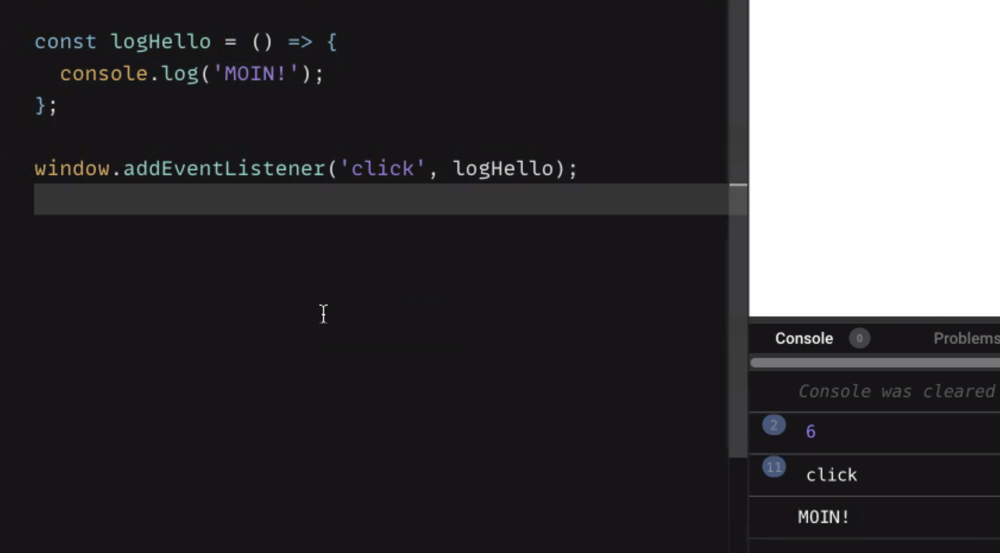
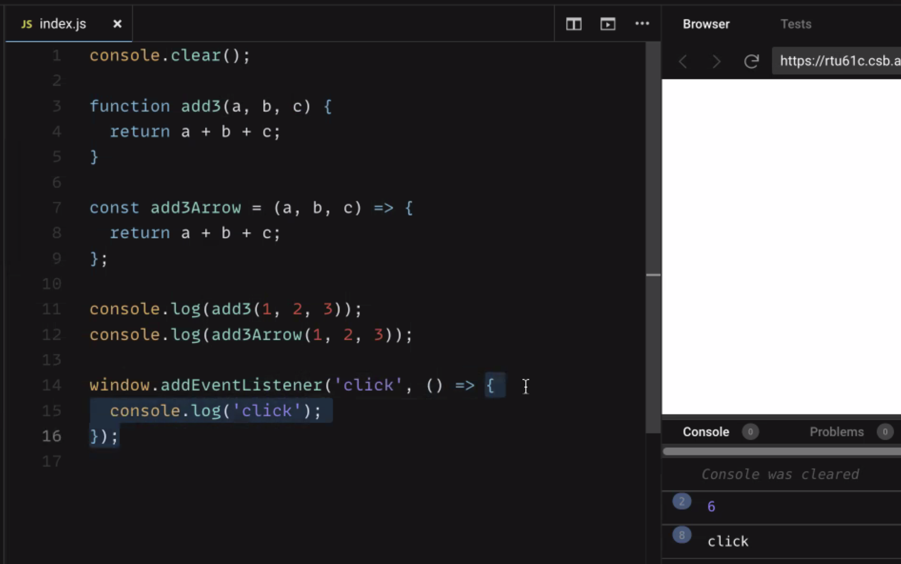

- [JavaScript Basics](#JavaScript-Basics)

  - [Selecting HTML Elements: `.querySelector()`](#Selecting-HTML-Elements-querySelector)
  - [Add Interaction: `.addEventListener()`](#Add-Interaction-addEventListener)
  - [Add/remove & toggle classes: `.classList.`](#Add-remove-toggle-classes-classList)
  - [Resources – JavaScript Basics](#Resources-JavaScript-Basics)
  - [Challenges](#Challenges-JS-Basics)

- [JS Variables and Numbers](#JS-Variables-and-Numbers)

  - [Variable Declarations](#Variable-Declarations)
  - [Resources – JS Variables and Numbers](#Recources-JS-Variables-and-Numbers)
  - [Challenges](#Challenges-JS-Variables-and-Numbers)

- [JS Conditions and Booleans](#JS-Conditions-and-Booleans)

  - [Control Flow: `if` / `else`](#Control-Flow-if-else)
  - [Ternary Operator: `?` `:`](#Ternary-Operator)
  - [Advanced: The strangeness of boolean coercion and making use of non-strict equality](#Advanced)
  - [Resources – JS Conditions and Booleans](#Resources-JS-Conditions-and-Booleans)
  - [Challenges](#Challenges-JS-Conditions-and-Booleans)

- [JS Functions](#JS-Functions)

  - [Function Declarations](#Function-Declarations)
  - [Parameters](#Parameters)
  - [Function Calls](#Function-Calls)
  - [Resources](#Resources-Functions)
  - [JS Functions](#Challenges-JS-Functions)

- [JS Functions 2](#JS-Functions-2)

  - [Return Statements](#Return-Statements)
  - [Early Return Statements](#Early-Return-Statements)
  - [Arrow Function Expressions](#Arrow-Function-Expressions)
  - [Resources](#Resources-JS-Functions-2)
  - [Challenges](#Challenges-JS-Functions-2)

- [Inputs and Strings](#Inputs-and-Strings)

  - [Strings](#Strings)
  - [Template Literals](#Template-Literals)
  - [String Properties and Methods](#String-Properties-and-Methods)
  - [Input Fields](#Input-Fields)
  - [Resources](#Resources)
  - [Challenges](#Challenges-Inputs-and-Strings)

- [JS Callback Functions](#JS-Callback-Functions)

  - [Callback Functions](#Callback-Functions)
  - [Named Callback Functions](#Named-Callback-Functions)
  - [Higher Order Functions](#Higher-Order-Functions)
  - [Parameters in Callback Functions](#Parameters-in-Callback-Functions)
  - [Resources](#Resources)
  - [Challenges](#Challenges-JS-Callback-Functions)

- [JS Forms](#JSForms)

  - [Understanding the Default Behavior of Form Submit](#UnderstandingtheDefaultBehaviorofFormSubmit)
  - [Listening to the `submit` event and preventing the Default](#ListeningtothesubmiteventandpreventingtheDefault)
  - [The `event` Object and `event.target`](#The-event-Object-and-event.target)
  - [Accessing Interactive Fields: `event.target.elements` and the `name` Attribute](#Accessing-Interactive-Fields)
  - [Using Input Values](#Using-Input-Values)
  - [Exception: Reading Values from Checkboxes](#Exception-Reading-Values-from-Checkboxes)
  - [Resources](#Resources)
  - [Challenges](#Challenges-JS-Callback-Functions)

- [JS createElement](#JScreateElement)

  - [The DOM](#TheDOM)
  - [`document.createElement`](#document.createElement)
  - [Element Properties and Methods](#ElementPropertiesandMethods)
  - [Common Element Properties and Methods](#CommonElementPropertiesandMethods)
  - [`.innerHTML`](#innerHTML)
  - [Resetting Element Content](#ResettingElementContent)
  - [Resources](#Resources)
  - [Challenges](#ChallengesJScreateElement)

- [JS Forms 2](#JSForms2)

  - [HTML Form Validation]([#HTMLFormValidation)
  - [The `input` Event](#TheinputEvent)
  - [Focus Input Fields](#FocusInputFields)
  - [Resetting Forms](#ResettingForms)
  - [Resources](#Resources)
  - [Challenges](#ChallengesJSForms2)

- [JS Objects and Arrays](#JSObjectsandArrays)

  - [Arrays](#Arrays)
  - [Objects](#Objects)
  - [Nested Objects / Arrays](#NestedObjects/Arrays)
  - [Resources](#Resources)
  - [Challenges](#ChallengesJSObjectsandArrays)

- [JS Loops](#JSLoops)
  - [What is a loop](#Whatisaloop)
  - [`while`](#while)
  - [`for`](#for)
  - [`for...in`](#for...in)
  - [`for...of`](#for...of)
  - [Resources](#Resources)
  - [Challenges](#ChallengesJSLoops)

---

# JavaScript Basics

<a name="JavaScript-Basics"></a>

## Learning Objectives

- Connect a JavaScript file with `<script src="./index.js" defer></script>`
- Log to the console
- Select elements with `querySelector`
- Add, remove and toggle CSS classes on `click` with `addEventListener`

---

<a name="Selecting-HTML-Elements-querySelector"></a>

## Selecting HTML Elements: `.querySelector()`

<details>
Before we can add interactivity, we need to select the necessary HTML-Elements:

```html
<body>
  <main class="main" id="main" data-js="main">...</main>
</body>
```

```js
const mainElement = document.querySelector('[data-js="main"]');
```

```js
// tag as identifier
const mainElement = document.querySelector("main");
// class as identifier -> .
const mainElement = document.querySelector(".main");
// id as identifier -> #
const mainElement = document.querySelector("#main");
```

</details>

<a name="Add-Interaction-addEventListener"></a>

## Add Interaction: `.addEventListener()`

<details>
The method `addEventListener` is used to react to events.

```html
<button type="button" data-js="button">Log into console</button>
```

First you specify the kind of event, e.g. **click**, then you define what code should be executed
when the event is triggered. You write that code between the `{}` brackets, e.g. a `console.log`.

```js
const button = document.querySelector('[data-js="button"]');
button.addEventListener("click", () => {
  console.log("Yeah");
});
```

There different events you can listen to, for example:

```js
button.addEventListener("mouseover", () => {});
```

```js
button.addEventListener("keydown", () => {});
```

[Simple calculator b](https://codesandbox.io/s/js-operators-calculator-01b-dzku84)

```js
addButton.addEventListener("click", () => {
  myResult = operand1 + operand2;
  console.log(myResult);
  /* 1. Add the two operands and store the result in a variable. 
  Log the variable's value to the console. */
});
```

[Counter b](https://codesandbox.io/s/js-counter-01b-h9nr4b)
[Counter b2](https://codesandbox.io/s/js-counter-01b2-6e64wt)

```js
addButton.addEventListener("click", () => {
  counter++;
  console.log(counter);
  resultOutput.textContent = counter;
});
```

[Simple calculator b](https://codesandbox.io/s/js-operators-calculator-01b-dzku84)

```js
decreaseByFiveButton.addEventListener("click", () => {
  myResult = operand1 - 5;
  console.log(myResult);
  // 8. Decrease the value of "operand1" by 5. Log the new value to the console.
});
```

> [list of event types](https://developer.mozilla.org/en-US/docs/Web/Events#event_listing).

</details>

<a name="Add-remove-toggle-classes-classList"></a>

## Add/remove & toggle classes: `.classList.`

<details>
You can add, remove and toggle classes, e.g. to change the styling of an element.

```html
<main data-js="main">
  <button type="button" data-js="button">Add a class</button>
</main>
```

Add **page--primary** class to the above main section by using the `selectedElement.classList.add`
method:

```js
const main = document.querySelector('[data-js="main"]');
const button = document.querySelector('[data-js="button"]');
button.addEventListener("click", () => {
  main.classList.add("page--primary");
});
```

A click on the button adds the class **page--primary** to the main element:

```html
<main data-js="main" class="page--primary">
  <button type="button" data-js="button">Add a class</button>
</main>
```

You can also remove or toggle a class in the same way:

```js
main.classList.remove("page--primary");
```

```js
main.classList.toggle("page--primary");
```

[Fix the errors in a Survey App b](https://codesandbox.io/s/js-errors-01-b-1teglv)

```js
firstChoiceButton.addEventListener("click", () => {
  firstChoiceButton.classList.add("active-choice");
  secondChoiceButton.classList.remove("active-choice");
  console.log("Selected first choice");
});
```

[Dark Mode b](https://codesandbox.io/s/js-darkmode-01-b-9iniru)

```js
toggleButton.addEventListener("click", () => {
  bodyElement.classList.toggle("dark");
});
```

[Functions and DOM manipulation b2](https://codesandbox.io/s/functions-and-dom-manipulation-01b2-r2jr07)

```js
function removeAllColors(classname) {
  box.classList.remove("red", "blue", "green", "gray");
}

function addColor(className) {
  box.classList.add(className);
}
```

```js
redButton.addEventListener("click", () => {
  removeAllColors();
  addColor("red");
  // Code here
});
```

</details>
<a name="Resources-JavaScript-Basics"></a>

## Resources

<details>
### Connect a JavaScript file

[The Script element](https://developer.mozilla.org/en-US/docs/Web/HTML/Element/script)

### Hello World

[Console](https://developer.mozilla.org/en-US/docs/Web/API/Console)

### Selecting HTML Elements

[Document](https://developer.mozilla.org/en-US/docs/Web/API/Document)

[Using data attributes](https://developer.mozilla.org/en-US/docs/Learn/HTML/Howto/Use_data_attributes)

[document.querySelector](https://developer.mozilla.org/en-US/docs/Web/API/Document/querySelector)

[data-\* attribute](https://developer.mozilla.org/en-US/docs/Web/HTML/Global_attributes/data-*)

### Add Interaction

[.addEventListener()](https://developer.mozilla.org/en-US/docs/Web/API/EventTarget/addEventListener)

[Event reference](https://developer.mozilla.org/en-US/docs/Web/Events#event_listing)

### Add/remove & toggle classes

[classList](https://developer.mozilla.org/de/docs/Web/API/Element/classList)

</details>

<a name="Challenges-JS-Basics"></a>

## Challenges

<details>

- [Console Methods `console.log()` a](https://codesandbox.io/s/js-console-01-a-yriwbj)

- [Console Methods `console.log()` b](https://codesandbox.io/s/js-console-01-b-o275lh)

- [Fix the errors in a Survey App a](https://codesandbox.io/s/js-errors-01-a-rhntrf)

- [Fix the errors in a Survey App b](https://codesandbox.io/s/js-errors-01-b-1teglv)

- [Dark Mode a](https://codesandbox.io/s/js-darkmode-01-a-fx6928)

- [Dark Mode b](https://codesandbox.io/s/js-darkmode-01-b-9iniru)

</details>

---

---

[🌑👣🌕 Top 🌕👣🌑](#Top)

<a name="JS-Variables-and-Numbers"></a>

# JS Variables and Numbers

## Learning Objectives

- knowing the difference between `var`, `let` and `const`
- understanding the different data types
- using basic math operations

---

<a name="Variable-Declarations"></a>

## Variable Declarations

<details>

```js
const aNewVariable = 1234;
```

The keyword `let` is only used when you need to reassign a value, for example when you want to
increase a counter.

```js
let counter = 0;
counter = counter + 1; // reassigning the value of counter
```

</details>

<a name="Recources-JS-Variables-and-Numbers"></a>

## Resources

<details>
- [Operator Precedence MDN](https://developer.mozilla.org/en-US/docs/Web/JavaScript/Reference/Operators/Operator_Precedence)

## </details>

<a name="Challenges-JS-Variables-and-Numbers"></a>

## Challenges

<details>

- [Data for a social media post a](https://codesandbox.io/s/js-variables-numbers-sm-post-01a-9skjpx)
- [Data for a social media post b](https://codesandbox.io/s/js-variables-numbers-sm-post-01b-0ed6mi)
- [Simple calculator a](https://codesandbox.io/s/js-operators-calculator-01a-x2y180)
- [Simple calculator b](https://codesandbox.io/s/js-operators-calculator-01b-dzku84)
- [Counter a](https://codesandbox.io/s/js-counter-01a-p7q2o4)
- [Counter b](https://codesandbox.io/s/js-counter-01b-h9nr4b)
- [Counter b2](https://codesandbox.io/s/js-counter-01b2-6e64wt)
- [Calculator a](https://codesandbox.io/s/js-calculator-01a-cuzd43)
- [Calculator a]()

</details>

---

---

[🌑👣🌕 Top 🌕👣🌑](#Top)

<a name="JS-Conditions-and-Booleans"></a>

# JS Conditions and Booleans

## Learning Objectives

- using conditions to control the program flow
- understanding what booleans and truthy/falsy values are
- working with comparison and logical operators
- writing ternary expressions

---

<a name="Control-Flow-if-else"></a>

## Control Flow: `if / else`

<details>
With an if statement we can control whether a part of our code is executed or not, based on a
condition.

```js
const isSunShining = true;
if (isSunShining) {
  // code that is executed only if condition "isSunShining" is true
}
```

The else block is executed only if the condition is `false`.

```js
const isSunShining = false;
if (isSunShining) {
  // code that is executed only if condition "isSunShining" is true
} else {
  // code that is executed only if condition "isSunShining" is false
}
```

The condition expression between the `()` brackets can be composed of logical or comparison
operators as well. You can distinguish between more cases by chaining `else if` statements:

```js
if (hour < 12) {
  console.log("Good Morning.");
} else if (hour < 18) {
  console.log("Good afternoon.");
} else if (hour === 24) {
  console.log("Good night.");
} else {
  console.log("Good evening.");
}
```

[Grasshopper - If/else syntax debug b](https://www.codewars.com/kata/57089707fe2d01529f00024a/solutions/javascript)

```js
function checkAlive(health) {
  if (health > 0) {
    return true;
  } else health <= 0;
  {
    return false;
  }
}
```

If the condition is not a boolean, it is converted into one by type coercion. This can be used to
check whether a value is not 0 or an empty string:

```js
const name = "Alex";
if (name) {
  console.log("Hi " + name + "!"); // only executed if name is not an empty string
}
```

[Teenager check b](https://codesandbox.io/s/js-teenager-check-01b-wop7vo)

```js
button.addEventListener("click", () => {
  // Number(x) converts the string from the input to a number
  // Beware: input values are *always* strings!
  const age = Number(input.value);

  // Exercise:
  // Use conditions and the logical AND operator to write
  // "You are a teen." or "You are not a teen." into the output.
  if (age > 12 && age < 20) {
    output.textContent = "You are a teen.";
  } else {
    output.textContent = "You are not a teen.";
  }
});
```

[Greeting Page b](https://codesandbox.io/s/js-functions-2-greeting-page-01b-ryxy58)

```js
const display = document.querySelector('[data-js="display"]');

function getGreeting() {
  if (new Date().getHours() > 5 && new Date().getHours() < 12) {
    return "Good Morning";
  } else if (new Date().getHours() > 12 && new Date().getHours() < 19) {
    return "Good Afternoon";
  } else if (new Date().getHours() > 18 && new Date().getHours() < 23) {
    return "Good Evening";
  } else if (new Date().getHours() > 22 && new Date().getHours() < 6) {
    return "Good Night";
  }
  // Code here
}

display.textContent = getGreeting();
document.body.style.backgroundColor = getDayColor();
```

</details>

<a name="Ternary-Operator"></a>

## Ternary Operator: `? :`

<details>
With if / else statements whole blocks of code can be controlled. The ternary operator can be used
if you want to decide between two _expressions_, e.g. which value should be stored in a variable:

```js
const greetingText = time < 12 ? "Good morning." : "Good afternoon.";
```

[Grasshopper - Personalized Message b](https://www.codewars.com/kata/5772da22b89313a4d50012f7/solutions/javascript)

```js
function greet(name, owner) {
  return name === owner ? "Hello boss" : "Hello guest";
}
```

```js
function greet(name, owner) {
  if (name === owner) {
    return "Hello boss";
  }
  return "Hello guest";
}
```

The ternary operator has the following structure:

```js
condition ? expressionIfTrue : expressionIfFalse;
```

If the condition is true, the first expression is evaluated, otherwise the second expression. The
ternary operator can be used to decide which function should be called:

```js
isUserLoggedIn ? logoutUser() : loginUser();
```

It can also distinguish which value should be passed as an argument to a function:

```js
moveElement(xPos > 300 ? 300 : xPos); // the element can't be moved further than 300.
```

> ❗️ The operator can only distinguish between two _expressions_ like values, math / logical
> operations or function calls, not between _statements_ like variable declarations, if / else
> statements or multi-line code blocks.

</details>

<a name="Advanced"></a>

## Advanced: The strangeness of boolean coercion and making use of non-strict equality

<details>
<summary>🫣 This is an advanced topic and not important for the challenges. Click to expand if you're curious.</summary>

Assume you want to check if a variable has a useful value for us to work with. `if(variable)` does
in fact not check if `variable` is defined but rather if it is truthy. Take a look at these
examples:

- `if(undefined)` → falsy, won't execute
- `if(null)` → falsy, won't execute
- `if("")` → falsy, won't execute, but might still be a useful variable  
  (e.g. when user clears an input field)
- `if(0)` → falsy, won't execute, but might still be a useful variable  
  (e.g. when user wants to set the volume to `0`)
- `if(" ")` → truthy, will execute
- `if(-1)` → truthy, will execute

It's useful to define a variable as not having a value when it's `undefined` or `null`. We can check
for that like this:

```js
if (variable != null) {
  console.log('This will be logged even if variable is 0 or ""');
}
```

This is one of the rare valid use cases for non-strict comparison (`!=` instead of `!==`).

JavaScript tries to coerce the compared values into the same type. And just like `"3" == 3` is
`true`, `undefined == null` is also `true`. This also works with `!=` instead of `==`.

> ⚠️ Remember that this is an exception for using non-strict equality. **Strict equality should
> otherwise always be preferred.**

</details>

<a name="Resources-JS-Conditions-and-Booleans"></a>

## Resources

<details>

### Operators

[MDN Comparison Operators](https://developer.mozilla.org/en-US/docs/Web/JavaScript/Guide/Expressions_and_Operators#comparison_operators)

[MDN Logical Operators](https://developer.mozilla.org/en-US/docs/Web/JavaScript/Guide/Expressions_and_Operators#logical_operators)

### if / else statements

[MDN about if else](https://developer.mozilla.org/en-US/docs/Web/JavaScript/Reference/Statements/if...else)

### Ternary Operator

[MDN Ternary Operator](https://developer.mozilla.org/en-US/docs/Web/JavaScript/Reference/Operators/Conditional_Operator)

</details>

<a name="Challenges-JS-Conditions-and-Booleans"></a>

## Challenges

<details>

- [Truthy and Falsy values a](https://codesandbox.io/s/truthy-and-falsy-01a-rui6pk)
- [Truthy and Falsy values b](https://codesandbox.io/s/truthy-and-falsy-01b-b62tpj)
- [Converting boolean values to strings a](https://www.codewars.com/kata/53369039d7ab3ac506000467/train/javascript)
- [Converting boolean values to strings b](https://www.codewars.com/kata/53369039d7ab3ac506000467/solutions/javascript)
- [Grasshopper - If/else syntax debug a](https://www.codewars.com/kata/53369039d7ab3ac506000467/train/javascript)
- [Grasshopper - If/else syntax debug b](https://www.codewars.com/kata/57089707fe2d01529f00024a/solutions/javascript)
- [Grasshopper - Personalized Message a](https://www.codewars.com/kata/5772da22b89313a4d50012f7/train/javascript)
- [Grasshopper - Personalized Message b](https://www.codewars.com/kata/5772da22b89313a4d50012f7/solutions/javascript)
- [Drink about a](https://www.codewars.com/kata/56170e844da7c6f647000063/train/javascript)
- [Drink about b](https://www.codewars.com/kata/56170e844da7c6f647000063/solutions/javascript)
- [Teenager check a](https://codesandbox.io/s/js-teenager-check-01a-nsnre7)
- [Teenager check b](https://codesandbox.io/s/js-teenager-check-01b-wop7vo)

</details>

---

---

[🌑👣🌕 Top 🌕👣🌑](#Top)

<a name="JS-Functions"></a>

# JS Functions

## Learning Objectives

- writing functions in JavaScript
- calling functions
- using function parameters
- learning what 'scope' is

---

<a name="Function-Declarations"></a>

## Function Declarations

<details>

The **function declaration** consists of:

- the function keyword
- the function name
- the function body (Javascript statements / Javascript code)

```js
function greet() {
  console.log("Hi Friends!");
  console.log("Nice to be here.");
}
```

</details>

<a name="Parameters"></a>

### Parameters

<details>
Parameters can be used like predefined variables inside the
function body. When declaring a function we are free to choose a name for the parameters , but
descriptive, short names should be chosen.

```js
function printLetter(name) {
  console.log("Hi " + name + ", hope you are fine. Love, Johnny");
}
function printSum(first, second, third) {
  const sum = first + second + third;
  console.log("The sum of your numbers is: " + sum);
}
```

[Functions with parameters 01 b](https://codesandbox.io/s/js-functions-with-parameters-01b-9lu4n4)

```js
function greetMary() {
  console.log("Welcome Mary, good to see you again!");
}
```

```js
function greet(name) {
  console.log("Welcome " + name + " , good to see you again!");
}

greet("Alice");
```

[Functions with parameters 02 b](https://codesandbox.io/s/js-functions-with-parameters-02b-ru361m)

```js
function printSquare(number) {
  const square = number * number;
  console.log(square);
}

printSquare(3);
printSquare(5);
```

```js
function printRectangleArea(widthRect, lengthRect) {
  const area = widthRect * lengthRect;
  console.log("The area of the rectangle is " + area);
}

printRectangleArea(5, 7);
printRectangleArea(3, 4);
```

[Calculations b](https://codesandbox.io/s/js-functions-2-calculations-01b-3krtc4)

```js
function add(a, b) {
  const sum = a + b;
  return sum;
  // Code here
}
```

</details>

<a name="Function-Calls"></a>

## Function Calls

<details>
When functions are defined you can call them by writing their name, followed by parentheses
("rounded brackets"). If the functions consume parameters you can pass them as arguments in the
brackets.

```js
greet();
/*
This will cause the following to be logged into the console:
Hi Friends!
Nice to be here.
*/
printLetter("Max");
printLetter("Jordan");
/*
This will cause the following to be logged into the console:
Hi Max, hope you are fine. Love, Johnny
Hi Jordan, hope you are fine. Love, Johnny
*/
printSum(1, 2, 3);
printSum(3, 4, 5);
/*
This will cause the following to be logged into the console:
The sum of your numbers is: 6
The sum of your numbers is: 12
*/
```

</details>

<a name="Resources-Functions"></a>

## Resources

<details>
[MDN docs: Functions](https://developer.mozilla.org/en-US/docs/Web/JavaScript/Guide/Functions)
[MDN docs: Scope](https://developer.mozilla.org/en-US/docs/Glossary/Scope)
</details>

<a name="Challenges-JS-Functions"></a>

## Challenges

<details>

- [Basic functions a](https://codesandbox.io/s/js-basic-functions-01a-d6j9pr)
- [Basic functions b](https://codesandbox.io/s/js-basic-functions-01b-7tydx3)
- [Functions with parameters 01 a](https://codesandbox.io/s/js-functions-with-parameters-01a-nt8m1q)
- [Functions with parameters 01 b](https://codesandbox.io/s/js-functions-with-parameters-01b-9lu4n4)
- [Functions with parameters 02 a](https://codesandbox.io/s/js-functions-with-parameters-02a-4q1qwz)
- [Functions with parameters 02 b](https://codesandbox.io/s/js-functions-with-parameters-02b-ru361m)
- [Functions and DOM manipulation a](https://codesandbox.io/s/functions-and-dom-manipulation-01a-jm46ly)
- [Functions and DOM manipulation b](https://codesandbox.io/s/functions-and-dom-manipulation-01b-skdtys)
- [Functions and DOM manipulation b2](https://codesandbox.io/s/functions-and-dom-manipulation-01b2-r2jr07)

## </details>

---

---

[🌑👣🌕 Top 🌕👣🌑](#Top)

<a name="JS-Functions-2"></a>

# JS Functions 2

## Learning Objectives

- What a return statement of a function is and how to use it in your JavaScript functions
- What an `early return` is
- How to write functions with the `fat arrow notation`

---

<a name="Return-Statements"></a>

## Return Statements

<details>
A function can return a value back to the place where it was called. 
This is done via a `return statement`.

```js
function add3Numbers(first, second, third) {
  const sum = first + second + third;
  return sum;
}
```

The `return statement` begins with the keyword `return` followed by an expression. In this case,
the expression is the variable sum. Its value is returned by the function and can be stored when the
function is called:

```js
const firstSum = add3Numbers(1, 2, 3);
// the return value is stored in "firstSum", namely 6
const secondSum = add3Numbers(4, 123, 33);
// the return value is now stored in "secondSum", namely 160
```

> 💡 An expression is anything that produces a value: a variable, a hardcoded value like `true` or
> `6`, a math operation like `2 + 3` or even another function call!
> [This article](https://www.joshwcomeau.com/javascript/statements-vs-expressions/) explains this in
> greater depth.
> By this, we can outsource computations and / or decision processes and continue using the returned
> value in the program.

A function can return only one expression value, but can have multiple return statements, in
combination with if else statements for example:

```js
function checkInputLength(inputString) {
  if (inputString.length > 3) {
    return true;
  } else {
    return false;
  }
}
```

</details>

<a name="Early-Return-Statements"></a>

## Early Return Statements

<details>
As soon as a return statement is reached in a function call, the function execution is ended. The
following `console.log()` is therefore never reached:

```js
function testFunction() {
  return "a returned string";
  console.log("I am never logged in the console.");
}
```

This behavior can be used to our advantage as early return statements. Sometimes we want to execute
certain parts of our code only if a condition applies. We can check this with an if else statement.
When multiple conditions are in place, the code becomes harder to read and to understand:

```js
function setBackgroundColor(color) {
  if (typeof color === "String") {
    if (color.startsWith("#")) {
      if (color.length >= 7) {
        body.style.backgroundColor = color;
      }
    }
  }
}
```

An alternative approach is to terminate the function with early return statements:

```js
function setBackgroundColor(color) {
	// first condition
	if(typeOf color !== 'String') {
		return;
	}
	// second condition
	if(!color.startsWith('#')) {
		return;
	}
	// third condition
	if(color.length < 7) {
		return;
	}
	// only if all 3 conditions are passed the final line of code is executed.
	body.style.backgroundColor = color;
}
```

This way of writing the code is more readable

💡 Hint: A return statement can be left empty, the returned value is then `undefined`.

</details>

<a name="Arrow-Function-Expressions"></a>

## Arrow Function Expressions

<details>
Next to the classic function declaration, JavaScript has a second way to write functions as
`arrow function expressions`:

```js
const addNumbers = (first, second) => {
  return first + second;
};
```

The function is saved like a variable with the keyword `const`. The parameters are written normally
in round brackets followed by an fat arrow `=>`. Then the function body is written in curly
brackets.

[Drink about b](https://www.codewars.com/kata/56170e844da7c6f647000063/solutions/javascript)

```js
const peopleWithAgeDrink = (age) =>
  age < 14
    ? "drink toddy"
    : age < 18
    ? "drink coke"
    : age < 21
    ? "drink beer"
    : "drink whisky";
```

```js
var peopleWithAgeDrink = function (old) {
  if (old < 14) {
    return "drink toddy";
  } else if (old < 18) {
    return "drink coke";
  } else if (old < 21) {
    return "drink beer";
  } else {
    return "drink whisky";
  }
};
```




### Implicit Return Statements

The advantage of arrow functions are possible shorter notations when certain criteria apply:

1. Omit the round brackets around the parameters: This is possible, if there is only one input:
   ```js
   const addOne = (number) => {
     return number + 1;
   };
   ```
2. Implicit return statements: If the function consists only of a return statement, the curly
   brackets and the return keyword can be omitted:
   ```js
   const addNumbers = (first, second) => {
     return first + second;
   };
   ```
   can be rewritten as:
   ```js
   const addNumbers = (first, second) => first + second;
   ```

> 💡 This shorthand notation comes in handy as soon as we work with callback functions in a few
> days. So try to remember this feature.
> 💡 Maybe you remember the syntax of the `addEventListener` method. We encountered these arrow
> functions there already!
>
> ```js
> button.addEventListener('click',() => {
> 	...
> })
> ```

</details>

<a name="Resources-JS-Functions-2"></a>

## Resources

<details>

- [Statements vs Expressions by Josh Comeau](https://www.joshwcomeau.com/javascript/statements-vs-expressions/)

</details>

<a name="Challenges-JS-Functions-2"></a>

## Challenges

<details>

- [Calculations a](https://codesandbox.io/s/js-functions-2-calculations-01a-43zhms)
- [Calculations b](https://codesandbox.io/s/js-functions-2-calculations-01b-3krtc4)
- [Greeting Page a](https://codesandbox.io/s/js-functions-2-greeting-page-01a-fhkpm9)
- [Greeting Page b](https://codesandbox.io/s/js-functions-2-greeting-page-01b-ryxy58)
- [Progress Bar a](https://codesandbox.io/s/js-functions-2-progress-bar-01a-ctkeo2)
- [Progress Bar b](https://codesandbox.io/s/js-functions-2-progress-bar-01b-ceg30l)
- [Convert Arrow Functions a](https://codesandbox.io/s/js-functions-2-convert-arrow-functions-01a-n0ydj9)
- [Convert Arrow Functions b](https://codesandbox.io/s/js-functions-2-convert-arrow-functions-01b-qlrnyo)
</details>

[🌑👣🌕 Top 🌕👣🌑](#Top)

<a name="Inputs-and-Strings"></a>

# JS Inputs and Strings

## Learning Objectives

- learning different ways of writing strings
- using string properties and methods
- working with input elements

---

<a name="Strings"></a>

## Strings

<details>
There are three ways to create strings using _string literals_:

1. `'string'`: single quotes
2. `"string"`: double quotes
3. `` `string` ``: back ticks or **template literals**.

> 💡 In general there is no preference for using single or double quotes, except for stylistic
> reasons. Tools like prettier convert all strings to use the same style quotes. We have configured
> prettier to use single quotes by default. One reason to prefer one style of quotes over another on
> a case-by-case basis is when a quotation mark is part of the string:
>
> - `"It's such a nice day!"`
> - `'"Nice work", they said.'`
>   Strings can be chained together by using the `+` operator (yes, the same as the maths operator).
>   This is called **string concatination**:

```js
const name = "Alex";
const stringConcatination = "Hello " + name + ", good to see you!";
```

</details>
<a name="Template-Literals"></a>

## Template Literals

<details>
The third method to write strings has the useful property that you can insert variables into the
string by wrapping placeholders with a dollar sign and curly brackets `${}` . This is also called
**string interpolation**.

This way you don't have to concat multiple strings if you want to use a variable in your string:

```js
const stringConcatination = "Hello " + name + ", good to see you!";
const withTemplateString = `Hello ${name}, good to see you!`;
```

Any **expression** can be placed into these placeholders:

```js
const greeting = `Hello ${
  name !== null ? name : "mysterious person"
}, good to see you!`;
```

With template literals you can also write **multi-line strings**:

```js
`Hello,
this is in a new line.
Good bye!`;
```

</details>
<a name="String-Properties-and-Methods"></a>

## String Properties and Methods

<details>
Strings in JavaScript have some build-in **properties** and functionalities called **methods**. You
can call them with the dot notation followed by the name of the property / method.

```js
"A normal string".length; // evaluates to 15
"A normal string".toUpperCase(); // evaluates to "A NORMAL STRING"
```

> 💡 Methods are functions, thus they need to be invoked by placing `()` brackets after the name of
> the method.
> | Property / Method | Effect |
> | ----------------------------------- | ------------------------------------------------------------------------ |
> | `.length` | returns the number of characters in a string. |
> | `.toUpperCase()` | returns a all uppercase version of the string. |
> | `.toLowerCase()` | returns a all lowercase version of the string. |
> | `.trim()` | returns a string with all whitespace removed from the beginning and end. |
> | `.replaceAll(oldString, newString)` | replaces all occurrences of `oldString` with the `newString`. |
> | `.startsWith(subString)` | returns `true` if the string starts with subString. |
> | `.endsWith(subString)` | returns `true` if the string ends with subString. |
> | `.includes(subString)` | returns `true` if the string contains the subString. |

> 💡 Go to the
> [MDN Docs](https://developer.mozilla.org/en-US/docs/Web/JavaScript/Reference/Global_Objects/String#instance_properties)
> for even more string methods.

</details>
<a name="Input-Fields"></a>

## Input Fields

<details>
Every input field in HTML holds a **value** in form of a string. You can access the value by using
`.value` on the input Element:

```html
<form>
  <input data-js="textInput" type="text" value="test 123" />
  <input data-js="numberInput" type="number" value="42" />
</form>
```

```js
const textInput = document.querySelector('[data-js="textInput"]');
const numberInput = document.querySelector('[data-js="numberInput"]');
textInput.value; // evaluates to 'test 123'
numberInput.value; // evaluates to '42' (still a string!)
```

You can also change the value of the input by assigning a new value to this input property:

```js
textInput.value = "changed value!";
```

This change is immediately visible on the website.

For example, you can enforce all uppercase letters in a form by combining this functionality with an
`input` event listener on the input element:

```js
// transform on every change the input value to uppercase letters
textInput.addEventListener("input", () => {
  const oldValue = textInput.value;
  const newValue = oldValue.toUpperCase();
  textInput.value = newValue;
});
```

</details>
<a name="Resources"></a>

## Resources

<details>

### String Methods

[MDN Docs: String Methods](https://developer.mozilla.org/en-US/docs/Web/JavaScript/Reference/Global_Objects/String#instance_properties)

</details>

<a name="Challenges-Inputs-and-Strings"></a>

## Challenges

<details>

- [Thomas Example](https://codesandbox.io/s/js-inputs-strings-input-to-uppercase-example-7xw9ou)
- [Input to uppercase Challenge a](https://codesandbox.io/s/js-inputs-strings-input-to-uppercase-challenge-01a-2zhb49)
- [Input to uppercase Challenge b](https://codesandbox.io/s/js-inputs-strings-input-to-uppercase-challenge-01b-5178pk)
- [Input to uppercase and lowercase Challenge a](https://codesandbox.io/s/js-inputs-strings-input-to-uppercase-and-lowercase-challenge-01a-h8erxx)
- [Input to uppercase and lowercase Challenge b](https://codesandbox.io/s/js-inputs-strings-input-to-uppercase-and-lowercase-challenge-01b-jdidof)
- [Switch values Challenge a](https://codesandbox.io/s/js-inputs-strings-switch-values-challenge-01a-xp679g)
- [Switch values Challenge b](https://codesandbox.io/s/js-inputs-strings-switch-values-challenge-01b-6ceihi)
- [Multiple inputs Challenge a](https://codesandbox.io/s/js-inputs-strings-multiple-inputs-01a-95xn7d)
- [Multiple inputs Challenge b1](https://codesandbox.io/s/js-inputs-strings-multiple-inputs-01b1-9m1ju5)
- [Multiple inputs Challenge b2](https://codesandbox.io/s/js-inputs-strings-multiple-inputs-01b2-u3j5yu)
- [Multiple inputs Challenge b3](https://codesandbox.io/s/js-inputs-strings-multiple-inputs-01b3-cknkq8)
- [Change Box Appearance Advanced Challenge a](https://codesandbox.io/s/js-inputs-strings-change-box-appearance-advanced-01a-pfh70k)
- [Change Box Appearance Advanced Challenge b](https://codesandbox.io/s/js-inputs-strings-change-box-appearance-advanced-01b-ip1c44)

Changing the appearance of a box when the values of sliders (color, border radius, rotation) change

- [Remove String Spaces a]()
- [Remove String Spaces b]()
- [Reversed Strings a]()
- [Reversed Strings b]()
- [String repeat a]()
- [String repeat b]()
- [Convert a Number to a String a]()
- [Convert a Number to a String b]()

</details>

[🌑👣🌕 Top 🌕👣🌑](#Top)
<a name="JS-Callback-Functions"></a>

# JS Callback Functions

## Learning Objectives

- Understanding the concept of callback functions
- Using an anonymous callback function
- Using a named function as a callback function
- Knowing what a higher order function is

---

<a name="Callback-Functions"></a>

## Callback Functions

<details>
A callback function is a function that is passed **as an argument** into another function.

The outer function can execute this callback function at the correct moment or multiple times, for
example:

- when an event is triggered
- when the fetched data arrived on your computer
- for each element in an array.

Callback functions are used, whenever the program itself needs to figure out **when** or **how many
times** the function needs to be executed. We already used callback functions in **event
listeners**:

```js
button.addEventListener("click", () => {
  console.log("Inside the callback function.");
});
```

Here the structure is as follows:

- outer function: `addEventListener()`
- first argument: `'click'`
- second argument: callback function
  ```js
  () => {
    console.log("Inside the callback function.");
  };
  ```

This type of function is called **anonymous function**, since it is declared without giving it a
name.

</details>
<a name="Named-Callback-Functions"></a>

## Named Callback Functions

<details>
Any function can be used as a callback function. It just needs to be passed to another function. You
can declare a normal function and then use the **name of the function** to pass it into another
function:

```js
function sayHello() {
  console.log("Hey Dude!");
}
button.addEventListener("click", sayHello);
```

> ❗️ Note that we do not call the function here (we wrote `sayHello` instead of `sayHello()`). We
> only pass the function to the event listener. The function is only called when the event happens.

</details>
<a name="Higher-Order-Functions"></a>

## Higher Order Functions

<details>

A higher order function is a function that takes a **callback function as an argument** and **calls
the callback function** inside their body, e.g. the `addEventListener` method.

```js
// this function calls its callback function 3 times!
function myHigherOrderFunction(callback) {
  callback();
  callback();
  callback();
}
```

We will encounter these higher order functions in future sessions:

- `.then`
- `.forEach`
- `.map`
- `.filter`

> 💡 Don't worry, you don't have to write higher order functions yourself, you only apply them to
> solve certain problems.

</details>
<a name="Parameters-in-Callback-Functions"></a>

## Parameters in Callback Functions

<details>
A callback function can accept parameters. The values for the parameters are provided by the
function, that calls the callback function (the "higher order function").

In this example the callback function can accept a parameter to retrieve information about the
occurred event:

```js
button.addEventListener("click", (event) => {
  console.log("This button was clicked:", event.target);
});
```

</details>
<a name="Resources"></a>

## Resources

<details>
- [MDN Callback Functions](https://developer.mozilla.org/en-US/docs/Glossary/Callback_function)

</details>
<a name="Challenges-JS-Callback-Functions"></a>

## Challenges

<details>

- [Example Felix](https://codesandbox.io/s/js-callback-functions-intro-example-vszgz9)
- [Named vs. anonymous callback functions a](https://codesandbox.io/s/js-callback-f-named-vs-anonymous-callback-functions-01a-2vy13t)
- [Named vs. anonymous callback functions b](https://codesandbox.io/s/js-callback-f-named-vs-anonymous-callback-functions-01b-4kzjzx)
- [Callback functions with one argument a](https://codesandbox.io/s/js-callback-f-callback-functions-with-one-argument-01a-c69kxl)
- [Callback functions with one argument b](https://codesandbox.io/s/js-callback-f-callback-functions-with-one-argument-01b-8ebzl9)
- [Callback functions with multiple arguments a](https://codesandbox.io/s/js-callback-f-callback-functions-with-multiple-arguments-01a-eptlg6)
- [Callback functions with multiple arguments b](https://codesandbox.io/s/js-callback-f-callback-functions-with-multiple-arguments-01b-bsd0in)
- [Multiple callback functions a](https://codesandbox.io/s/js-callback-f-multiple-callback-functions-01a-79ec8f)
- [Multiple callback functions b](https://codesandbox.io/s/js-callback-f-multiple-callback-functions-01b-w1jobq)
</details>
[🌑👣🌕 Top 🌕👣🌑](#Top)

<a name="JSForms"></a>

# JS Forms

## Learning Objectives

- knowing the default behavior of form submit
  - understanding why to prevent this behavior with `.preventDefault()`
- knowing how to listen to submit events: the `event` object and its `target` property
- reading input values:
  - `event.target.elements`
  - `FormData`
  - the role of `name` attributes for form fields

---

<a name="UnderstandingtheDefaultBehaviorofFormSubmit"></a>

### Understanding the Default Behavior of Form Submit

<details>
If you click the submit button of a form, it triggers the following default behavior (without
writing _any_ JavaScript):

- The form sends a GET request with names and their values as prop inside an URL like
  `/?firstName=value1&lastName=value2&...`.
- The page is reloaded and thus the data is lost for us.

None of them is useful. You can prevent this behavior with a method called `.preventDefault()`.

</details>
<a name="ListeningtothesubmiteventandpreventingtheDefault"></a>

### Listening to the `submit` event and preventing the Default

<details>
In order to prevent this behavior of the `submit` event, you need to

- inside the event listener: receive the event object as the first input parameter to the callback
  function
- call `event.preventDefault()`

```js
const form = document.querySelector('[data-js="form"]');
form.addEventListener("submit", (event) => {
  event.preventDefault();
});
```

By calling `event.preventDefault()`, there won't be a GET request nor is the page reloaded on
submit.

</details>
<a name="The-event-Object-and-event.target"></a>

### The `event` Object and `event.target`

<details>
The `event` object is created whenever an event is triggered. You can accept it as the first
parameter in the callback function and thus access it inside the function body (e.g. via
`event.preventDefault()`).

For now, the most important method of the `event` object is `.preventDefault()`.

`event.target` is a reference to the element to which the event originated from - in this case - the
form.

```js
form.addEventListener("submit", (event) => {
  event.preventDefault();
  console.log(event.target);
});
// Output:
// <form data-js="form">
//		<fieldset>...</fieldset>
//		...
//		<button type="submit">Submit</button>
//	</form>
```

</details>
<a name="Accessing-Interactive-Fields"></a>

### Accessing Interactive Fields: `event.target.elements` and the `name` Attribute

<details>
While `event.target` represents the entire form, `event.target.elements` is a collection of all form
elements.

You get access to a specific element via its `name` attribute and dot notation:

```js
form.addEventListener("submit", (event) => {
  event.preventDefault();
  const formElements = event.target.elements;
  console.log(formElements.firstName);
  console.log(formElements.firstName.value);
});
```

Note that

- `event.target.elements` is stored in the variable `formElements` for better readability,
- `firstName` is the string value of the corresponding `name` attribute, as in
  `<input name="firstName"/>`, and
- `firstName.value` returns the user input for the field with `name="firstName"`.
</details>
<a name="Using-Input-Values"></a>

### Using Input Values

<details>
You can access all input values of the form by using `FormData()`. This constructor uses
`event.target` and can be transformed into a usable object afterwards:

```js
form.addEventListener("submit", (event) => {
  event.preventDefault();
  const formData = new FormData(event.target);
  const data = Object.fromEntries(formData);
  console.log(data);
});
```

This is very useful to easily access the input data of an entire form.

> 💡 Despite the fact that using `FormData` is much less verbose, `event.target.elements` is very
> useful if you want to access single form elements. (Spoiler alert: In case you want to focus a
> specific field after resetting the form, for example.)

</details>
<a name="Exception-Reading-Values-from-Checkboxes"></a>

### Exception: Reading Values from Checkboxes

<details>
Checkboxes have two states: checked ("true") and not checked ("false"). In contrast to other input
types, the `value` attribute does not reflect this change, but is only used as an identifier for the
checkbox.

You can access the checkbox's state via the `.checked` property instead.

Imagine the following checkbox

```html
<input type="checkbox" name="colorBlue" value="blue" />
```

and its corresponding JavaScript:

```js
console.log(formElements.colorBlue.checked); // output: true or false
console.log(formElements.colorBlue.value); // output (always): blue
```

</details>
<a name="Resources"></a>

## Resources

<details>

- [Event interface](https://developer.mozilla.org/en-US/docs/Web/API/Event#properties)

</details>
<a name="Challenges-JS-Callback-Functions"></a>

## Challenges

<details>

- [Part 1: Handle Form Submit a](https://codesandbox.io/s/js-forms-handle-form-submit-01a-3kkcsq)
- [Part 1: Handle Form Submit b](https://codesandbox.io/s/js-forms-handle-form-submit-01b-5r6e5k)
- [Part 2: Checkbox Input a](https://codesandbox.io/s/js-forms-part-2-checkbox-input-01a-k4ilmh)
- [Part 2: Checkbox Input b](https://codesandbox.io/s/js-forms-part-2-checkbox-input-01b-4u6ro0)
- [Part 3: Calculator a](https://codesandbox.io/s/js-formas-part-3-calculator-01a-htstdu)
- [Part 3: Calculator b](https://codesandbox.io/s/js-formas-part-3-calculator-01b-bw0176)

</details>

[🌑👣🌕 Top 🌕👣🌑](#Top)

<a name="JScreateElement"></a>

# JS createElement

## Learning Objectives

- knowing what the DOM is
- learning how to generate HTML in JavaScript
- using HTML element object properties and methods
- learning how to use `.innerHTML`

---

<a name="TheDOM"></a>

## The DOM

<details>
The **Document Object Model** is a representation of the HTML document. Each HTML Tag is modelled as
a **node** in a tree structure, which shows how HTML elements are nested. A computer program such as
your JavaScript file can access and manipulate the HTML website by changing the DOM via the
`document` object. 
</details>

<a name="document.createElement"></a>

## `document.createElement`

<details>
You can generate an HTML element with Javascript by using the `document.createElement` method. It
expects the type of element as an argument.

```js
const article = document.createElement("article");
const button = document.createElement("button");
```

After generating an element, you need to place the element into the DOM. For this, you can use the
`.append` method. It places the element as the **last child** into the respective element.

```js
body.append(article); // placing the created article at the end of the body
article.append(button); // placing the created button into the article
```

The result looks like this:

```html
<body>
  ...
  <article>
    <button></button>
  </article>
</body>
```

</details>

<a name="ElementPropertiesandMethods"></a>

## Element Properties and Methods

<details>
As well as with queried HTML elements (via `querySelector`), we can add classes, event listeners and
more to the created HTML elements.

```js
article.classList.add("card");
button.addEventListener("click", () => {
  console.log("It works!");
});
```

The text of an element can be changed by reassigning the `.textContent` property:

```js
button.textContent = "Click me!";
```

</details>

<a name="CommonElementPropertiesandMethods"></a>

### Common Element Properties and Methods

<details>
| Property          | Effect                                                             |
| ----------------- | ------------------------------------------------------------------ |
| `classList`       | add, toggle or remove classes from element                         |
| `textContent`     | get or set text inside element                                     |
| `style`           | define inline style, e.g. `element.style.backgroundColor = "red" ` |
| `hidden`          | boolean whether element is hidden or not                           |
| `focus()`         | focusses the element on the website                                |
| `hasAttribute()`  | returns true if the element has the given attribute                |
| `querySelector()` | returns the first child that matches the given CSS selector        |

> 💡 You can assign HTML attributes by using the element properties. Go to the
> [MDN Docs](https://developer.mozilla.org/en-US/docs/Web/API/Element#properties) for a
> comprehensive list of element properties.

</details>

<a name="innerHTML"></a>

## `.innerHTML`

<details>
> ❗️ innerHTML can be unsafe when user input is passed into the template literal. Use it with
> caution. Read
> [this article](https://developer.mozilla.org/en-US/docs/Web/API/Element/innerHTML#replacing_the_contents_of_an_element)
> for more information about it.
The `innerHTML` property can be used to create the entire html layout of an element by passing the
html code as a string. By using **template literals** the content of the html can be dynamically
created.

```js
const cityName = "Lissabon";
article.innerHTML = `
	<h2> ${cityName} </h2>
	<p class="card__content">
		${cityName} is a very beautiful city in Portugal. 
		Go there and enjoy the stay!
	</p>
	<button type='button' class="card__booking-button"> 
		Book Trip 
	</button>
`;
```

This HTML code is rendered then **inside** the article element:

```html
<body>
  ...
  <article>
    <h2>Lissabon</h2>
    <p class="card__content">
      Lissabon is a very beautiful city in Portugal. Go there and enjoy the
      stay!
    </p>
    <button type="button" class="card__booking-button">Book Trip</button>
  </article>
</body>
```

</details>

<a name="ResettingElementContent"></a>

### Resetting Element Content

<details>
`.innerHTML` can also be used to **reset** the content of an element, e.g. a container:

HTML before:

```html
<ul data-js="cardContainer">
  <li class="card">...</li>
  <li class="card">...</li>
  <li class="card">...</li>
</ul>
```

By setting the innerHTML to an empty string, the content is deleted:

```js
const cardContainer = document.querySelector('ul[data-js="cardContainer"]');
cardContainer.innerHTML = "";
```

The result:

```html
<ul data-js="cardContainer"></ul>
```

</details>

<a name="Resources"></a>

## Resources

<details>
### Element Properties

[MDN Docs about element Properties](https://developer.mozilla.org/en-US/docs/Web/API/Element#properties)

### innerHTML

[MDN Docs about securtiy risks with innerHTML](https://developer.mozilla.org/en-US/docs/Web/API/Element/innerHTML#replacing_the_contents_of_an_element)

</details>

<a name="ChallengesJScreateElement"></a>

<details>

- [Example Stefan](https://codesandbox.io/s/js-create-element-example-stefan-w85we8)
- [Example Thomas](https://codesandbox.io/s/js-create-element-example-thomas-0fjde4)
- [Toast Messages a](https://codesandbox.io/s/js-create-element-toast-messages-01a-ttupcn)
- [Toast Messages b](https://codesandbox.io/s/js-create-element-toast-messages-01b-n3dr6q)
- [Social Media Post a](https://codesandbox.io/s/js-create-element-social-media-post-01a-uyg9jg)
- [Social Media Post b](https://codesandbox.io/s/js-create-element-social-media-post-01b-qzqr9m)
- [Product teaser a](https://codesandbox.io/s/js-create-element-product-teaser-01a-jit134)
- [Product teaser b](https://codesandbox.io/s/js-create-element-product-teaser-01b-u5g5zh)

</details>

[🌑👣🌕 Top 🌕👣🌑](#Top)

<a name="JSForms2"></a>

# JS Forms 2

<details>

## Learning Objectives

- knowing ways for client-side form validation
- understanding the input event
- knowing how to focus an input field programmatically
- knowing how to reset a form

---

</details>

<a name="HTMLFormValidation"></a>

### HTML Form Validation

<details>
Before submitting a form, it is important to ensure all required form fields are filled out, in the
correct format. This is called **client-side form validation**.

HTML provides several form field attributes to enable validation features build into the browser.

| Attribute                 | Description                                                                     |
| ------------------------- | ------------------------------------------------------------------------------- |
| `required`                | if present, a form field needs to be filled in before the form can be submitted |
| `minlength` / `maxlength` | minimum and maximum length of textual data (strings)                            |
| `min` / `max`             | minimum and maximum values of numerical input types                             |
| `type`                    | each input type has its own prefigured validation (like `email`)                |
| `pattern`                 | a regular expression pattern the entered data needs to follow                   |

The following input field is valid if there is a string between 3 and 30 characters:

```html
<input
  id="input-name"
  type="text"
  name="name"
  minlength="3"
  maxlength="30"
  required
/>
```

> ❗️ If the `required` attribute is omitted, the field is valid if it is empty or has a content
> between 3 and 30 characters, but is invalid when entering 1 or 2 characters.
> `type="email"` will check for an email-like format, i.e. that the input contains an `@` somewhere in
> between.

```html
<input id="input-email" type="email" name="email" />
```

> 💡 An alternative approach to client-side form validation is writing JavaScript functionality that
> checks a field's content. This topic might be discussed in future lessons.

</details>

<a name="TheinputEvent"></a>

### The `input` Event

<details>
Occasionally you might want to process an individual field's content before the form has been
submitted.

The `input` event is fired every time when the value of a form field has been changed. For example,
a `<textarea />` will fire this event with every keystroke.

```js
const messageField = document.querySelector('[data-js="message"]');
messageField.addEventListener("input", (event) => {
  console.log(event.target.value);
});
```

> ❗️ Don't confuse the `input` event with the `change` event, which is only fired after a field's
> content has been submitted (like pressing "enter" or removing focus from the field)

</details>

<a name="FocusInputFields"></a>

### Focus Input Fields

<details>
You can focus a specific input field with the help of the `.focus()` method. This can be used to
improve the user experience after submitting a form.

```js
const messageField = document.querySelector('[data-js="message"]');
form.addEventListener("submit", (event) => {
  event.preventDefault();
  // [...] handle form data
  messageField.focus();
});
```

Instead of the `querySelector`, this can also be achieved via the `event` object:

```js
form.addEventListener("submit", (event) => {
  event.preventDefault();
  // [...] handle form data
  event.target.elements.message.focus();
});
```

This will focus a form field with the attribute `name="message"`.

</details>

<a name="ResettingForms"></a>

### Resetting Forms

<details>

You can reset all form fields to their default value with the `.reset()` method.

```js
form.addEventListener("submit", (event) => {
  event.preventDefault();
  // [...] handle form data
  event.target.reset();
});
```

This often comes in handy in combination with `.focus()`. Think of a chat: after the message was
send, the form field is cleared and focussed again, so users can write the next message directly.

</details>

<a name="Resources"></a>

## Resources

<details>

- [MDN web docs: Client-side form validation](https://developer.mozilla.org/en-US/docs/Learn/Forms/Form_validation)
- [MDN web docs: input event](https://developer.mozilla.org/en-US/docs/Web/API/HTMLElement/input_event)
</details>

<a name="ChallengesJSForms2"></a>

## Challenges

<details>

- [Formvalidation a](https://codesandbox.io/s/js-forms-formvalidation-01a-pd8938)
- [Formvalidation b](https://codesandbox.io/s/js-forms-2-formvalidation-01b-jk9vqt)
- [Controlled input changed to upper-case a](https://codesandbox.io/s/js-forms-2-controlled-input-changed-to-upper-case-01a-dqqfnp)
- [Controlled input changed to upper-case b](https://codesandbox.io/s/js-forms-2-controlled-input-changed-to-upper-case-01b-9rnczk)
- [Simple live calculator a](https://codesandbox.io/s/js-forms-2-simple-live-calculator-01a-z4z0ht)
- [Simple live calculator b](https://codesandbox.io/s/js-forms-2-simple-live-calculator-01b-i9by1d)
- [Advanced: Simple todolist a2](https://codesandbox.io/s/js-forms-2-advanced-simple-todolist-01a-85c47w)
- [Advanced: Simple todolist b](https://codesandbox.io/s/js-forms-2-advanced-simple-todolist-01b-044usp)
- [Advanced: Simple todolist b2](https://codesandbox.io/s/js-forms-2-advanced-simple-todolist-01b2-qc9yf3)

</details>

[🌑👣🌕 Top 🌕👣🌑](#Top)

<a name="JSObjectsandArrays"></a>

[🌑👣🌕 Top 🌕👣🌑](#Top)

# JS Objects and Arrays

## Learning Objectives

- Creating, accessing, and manipulating arrays
- Creating, accessing, and manipulating objects
- Knowing how to find properties and methods of objects by logging

---

<a name="Arrays"></a>

## Arrays

<details>
Arrays are a structured data type which can store multiple values in one variable.

You can declare an array using `[]` square brackets (array literals):

```js
const shoppingList = ["apple", "tomato"];
```

Each item in the array has an index, which starts at 0. You can access individual items using the
bracket notation and the item's index:

```js
shoppingList[0]; // "apple"
shoppingList[1]; // "tomato"
```

Arrays can hold any type of value, even another array. This is called a nested array. The values of
nested arrays can be accessed by choosing the index of the nested array first and then stating the
index of the element inside the nested array.

```js
const nestedArray = ["a", 1, ["a", "new", "sentence"], false];
nestedArray[2][1]; // "new"
```

You can overwrite individual values in an array:

```js
const shoppingList = ["apple", "tomato"];
shoppingList[0] = "banana";
shoppingList; // ["banana","tomato"];
```

### Common Array Attributes and Methods

| Attribute / Method       | Effect                                           |
| ------------------------ | ------------------------------------------------ |
| `array.length`           | returns the number of elements in the array      |
| `array.push(element)`    | adds `element` to the end of the array           |
| `array.pop()`            | removes the last element of an array             |
| `array.unshift(element)` | adds `element` as the first element of the array |
| `array.shift()`          | removes the first element of the array           |

> 💡 There are much more array methods and attributes which we will discover in later sessions. Go
> to the
> [MDN Docs](https://developer.mozilla.org/en-US/docs/Web/JavaScript/Reference/Global_Objects/Array#instance_methods)
> for more information.

</details>

<a name="Objects"></a>

## Objects

<details>
Objects are a structured data type, which couple their values not to an index, but to a unique key.

You can declare an object using `{}` curly brackets (object initializer):

```js
const person = {
  name: "Max Blub",
  age: 21,
  isStudent: false,
};
```

You can access the properties using the dot notation:

```js
person.name; //"Max Blub"
```

You can also access the properties using the bracket notation:

```js
person["age"]; // 21
```

Objects can be nested:

```js
const person = {
  name: "Max Blub",
  age: 21,
  isStudent: false,
  address: {
    street: "Berliner Str.",
    houseNumber: 42,
    city: "Leipzig",
    zipCode: "12345",
  },
};
```

Nested values can be accessed by chaining the dot notation and/or the bracket notation together.

```js
person.address.street; // "Berliner Str."
person.address["city"]; // "Leipzig"
```

You can change values of object properties by reassigning them using the dot or bracket notation:

```js
person.name = "Max Bla";
person["age"] = 33;
```

You can add new properties in the same way:

```js
person.score = 15;
```

You can delete properties using the delete keyword:

```js
delete person.score;
```

</details>

<a name="NestedObjects"></a>

## Nested Objects / Arrays

<details>
Arrays can contain objects and vice versa:

```js
const peopleArray = [
  {
    name: "John",
    age: 22,
  },
  {
    name: "Alex",
    age: 33,
  },
];
```

```js
const user = {
  userId: "1234",
  mail: "test@mail.com",
  shoppingCart: ["tomato", "banana", "chocolate"],
};
```

You can access elements via chained dot / bracket notation:

```js
peopleArray[1].name; // "Alex"
user.shoppingCart[0]; // "tomato"
```

</details>

<a name="Resources"></a>

## Resources

<details>
### Array

[MDN Docs: Array](https://developer.mozilla.org/en-US/docs/Web/JavaScript/Reference/Global_Objects/Array)

### Object

[MDN Docs: Object](https://developer.mozilla.org/en-US/docs/Web/JavaScript/Reference/Global_Objects/Object)

</details>

<a name="ChallengesJSObjectsandArrays"></a>

##Challenges

<details>

- [Arrays a](https://codesandbox.io/s/js-objects-and-arrays-arrays-01a-jec8p4)
- [Arrays b](https://codesandbox.io/s/js-objects-and-arrays-arrays-01b-9gjuiq)
- [Objects a](https://codesandbox.io/s/js-objects-and-arrays-objects-01a-qr42jx)
- [Objects b](https://codesandbox.io/s/js-objects-and-arrays-objects-01b-x1c2ix)
- [Objects and Arrays a](https://codesandbox.io/s/js-objects-and-arrays-objects-and-arrays-01a-vjem3r)
- [Objects and Arrays b](https://codesandbox.io/s/js-objects-and-arrays-objects-and-arrays-01b-jlj8hs)
</details>

<a name="JSLoops"></a>

[🌑👣🌕 Top 🌕👣🌑](#Top)

# JS Loops

## Learning Objectives

- understanding the concept of loops
- understanding classic `for` loops
- understanding modern `for...in` and `for...of` loops
- understanding `while` loops

<a name="Whatisaloop"></a>

## What is a loop

<details>
A loop executes a respective block of code over and over again until an end criteria is met. In
JavaScript, two basic types of loops exist:

- `while` loop: are used when a task needs to be executed until a specific criteria is met.
- `for` loop: are commonly used when a given task needs to be executed x times or for each element
in an object / array.
</details>

<a name="while"></a>

## `while`

<details>
The while loop is the most fundamental type of loop. It repeats a code block as long as the stated
criteria is `true`.

```js
let string = "a";
while (string.length <= 8) {
  console.log(string);
  string = string + string;
}
// 'a'
// 'aa'
// 'aaaa'
// 'aaaaaaaa'
```

In this example, the while loop repeats itself 4 times, until the string becomes too long and the
loop criteria changes to `false`.

</details>

<a name="for"></a>

## `for`

<details>
`for` loops are intended for repeating a task a certain number of times. They consist of three
internal parts:

- an internal counter which is increased / decreased every iteration.
- a criteria which checks the value of the counter. As long as the criteria is `true`, the loop is
  executed.
- a rule how the counter is increased / decreased (in most cases it is increased by 1)

```js
for (let counter = 0; counter < 4; counter++) {
  console.log(counter);
}
// 0
// 1
// 2
// 3
```

The body of the for loop contains the code which is executed on each iteration. For the example
above it is a `console.log` which logs the value of the counter on each iteration until the value of
`counter` reached 4 and the loop is terminated.

</details>

<a name="for...in"></a>

## `for...in`

<details>
The `for...in` is a shorthand notation to loop through all keys of an object:

```js
const user = {
  name: "Alex",
  age: 28,
  email: "alex@mail.com",
};
for (const key in user) {
  console.log(user[key]);
}
// 'Alex'
// 28
// 'alex@mail.com'
```

The loop has an iterator variable, in this case `key` which is assigned the respective key value in
each iteration (first 'name', then 'age' and finally 'email').

</details>

<a name="for...of"></a>

## `for...of`

<details>
Similar to `for...in` the `for...of` loop is a shorthand notation, but for looping through all items
of an array.

```js
const fruits = ["apple", "banana", "melon"];
for (const fruit of fruits) {
  console.log(fruit);
}
// 'apple'
// 'banana'
// 'melon'
```

This time the iterator variable `fruit` is assigned the respective array item in each iteration.

</details>

<a name="Resources"></a>

## Resources

<details>
- [MDN article about loops and iterations](https://developer.mozilla.org/en-US/docs/Web/JavaScript/Guide/Loops_and_iteration)

</details>

<a name="ChallengesJSLoops"></a>

## Challenges

<details>

- [Example](https://codesandbox.io/s/js-loops-example-c7sl3q)
- [For Loop and `console.log`](https://codesandbox.io/s/js-loops-for-loop-and-console-log-01a-18kk2r)
- [For Loop and `console.log`](https://codesandbox.io/s/js-loops-for-loop-and-console-log-01b-4eepmk)
- [Star Rating](https://codesandbox.io/s/js-loops-star-rating-01a-p1nlir)
- [Star Rating](https://codesandbox.io/s/js-loops-star-rating-01b-mjm26n)
- [Creating a list](https://codesandbox.io/s/js-loops-creating-a-list-01a-4mjg57)
- [Creating a list](https://codesandbox.io/s/js-loops-creating-a-list-01b-17q3r0)
- [Select and Navigation Bar](https://codesandbox.io/s/js-loops-select-and-navigation-bar-01a-yfwzq7)
- [Select and Navigation Bar](https://codesandbox.io/s/js-loops-select-and-navigation-bar-01b-b4dc8e)
- [`while`](https://codesandbox.io/s/js-loops-while-01a-4moxqr)
- [`while`](https://codesandbox.io/s/js-loops-while-01b-qscmdx)
- [Bonus Challenge: Nested For Loop](https://codesandbox.io/s/js-loops-bonus-challenge-nested-for-loop-01a-rr8dj4)
- [Bonus Challenge: Nested For Loop](https://codesandbox.io/s/js-loops-bonus-challenge-nested-for-loop-01b-17ezsg)
</details>
